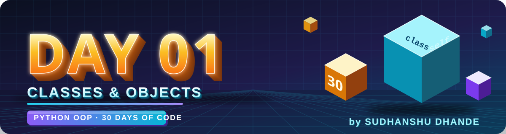
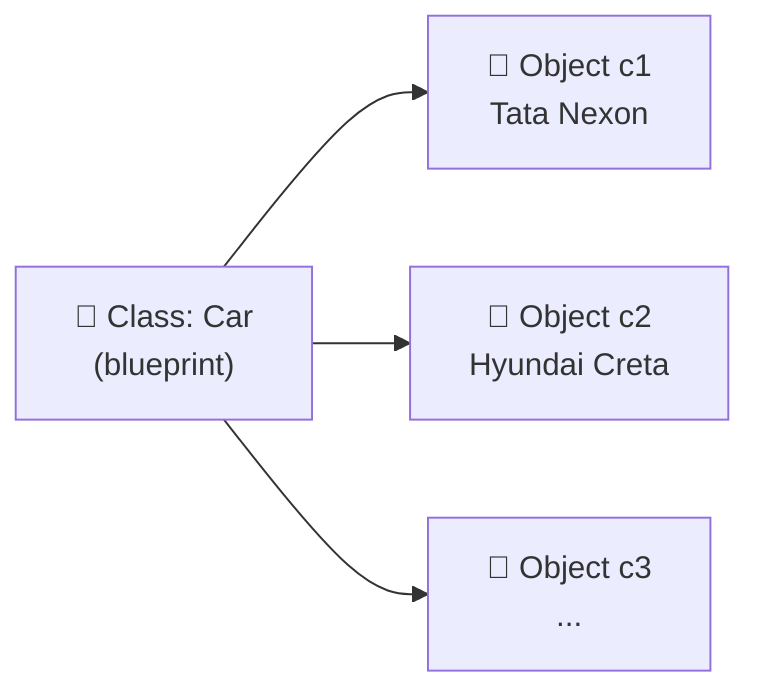

<p align="center">
  
</p>

<p align="center">
  
  
  
  
</p>

# 🟢 Day 01 — Classes & Objects

## 🎯 Learning Objectives

Today I will learn:

* What is a Class?
* What is an Object?
* How to create a class
* How to create objects
* Instance attributes
* Instance methods
* `self` keyword
* Accessing object attributes and methods
* Creating multiple objects from one class

---

# 📖 Day 01 Concepts — Read & Understand First

> Read this section slowly **before** solving the problems. Type every example yourself in VS Code and run it.

## 1️⃣ What is OOP?

**OOP (Object-Oriented Programming)** is a way of writing code where we organize our program around **real-world things (objects)** instead of only functions and variables.

Think of a real-world thing like a **Student**. A student has:

* **Data** → name, age, course (these are *attributes*)
* **Actions** → study, give exam, show result (these are *methods*)

OOP lets us pack the **data + actions** together in one place.

**Why use OOP?**

* ✅ Code is organized and easy to read
* ✅ Code can be reused (write once, use many times)
* ✅ Big projects become easier to manage
* ✅ Real-world problems are easier to model

> The 4 pillars of OOP (we will learn them in the coming days): **Encapsulation, Inheritance, Polymorphism, Abstraction**

---

## 2️⃣ What is a Class?

A **class** is a **blueprint** (or template) used to create objects.

> 🏠 **Analogy:** An architect's *house plan* is the class. The plan itself is not a house, but you can build many houses from it.
> 🍪 Or: a *cookie cutter* is the class, and the cookies are the objects.

A class defines **what data** an object will hold and **what actions** it can perform.

**Syntax:**

```python
class ClassName:
    # attributes and methods go here
    pass
```

**Example:**

```python
class Student:
    pass
```

📌 **Rules / conventions**

* Use the `class` keyword.
* Class names use **PascalCase** (each word starts with a capital): `Student`, `BankAccount`, `ShoppingCart`.
* A colon `:` after the name, and the body is indented.

---

## 3️⃣ What is an Object?

An **object** is an **instance** of a class — the *actual thing* created from the blueprint.

> If `Student` is the blueprint, then *Rahul* and *Priya* are two different objects (students) made from it.

**Creating an object:**

```python
class Student:
    pass

s1 = Student()   # s1 is an object of class Student
s2 = Student()   # s2 is another object of the same class
```

📌 The brackets `()` after the class name are **required** — they create the object. `s1 = Student` (without brackets) does **not** create an object.

---

## 4️⃣ What is an Attribute?

An **attribute** is a **variable that belongs to an object**. It stores the object's data (like name, age, price).

**Instance attributes** belong to one specific object. We can set them using the dot `.` operator:

```python
class Student:
    pass

s1 = Student()
s1.name = "Rahul"     # setting attributes
s1.age = 20

print(s1.name)        # Rahul   (accessing attributes)
print(s1.age)         # 20
```

* **Set:** `object.attribute = value`
* **Access:** `object.attribute`

> 💡 Every object keeps its **own copy** of its attributes. Changing `s1.name` does not change `s2.name`.

---

## 5️⃣ What is a Method?

A **method** is a **function defined inside a class**. It describes an action the object can perform.

```python
class Student:
    def greet(self):
        print("Hello, I am a student!")

s1 = Student()
s1.greet()            # Hello, I am a student!
```

* A method is called using the dot operator: `object.method()`
* The **first parameter** of an instance method is always `self`.

> 🔎 **Function vs Method:** a function stands alone; a method lives inside a class and works on the object.

---

## 6️⃣ What is `self`?

`self` is a **reference to the current object** — the object that is calling the method.

It lets a method **access that object's own attributes and methods**.

```python
class Student:
    def introduce(self):
        print(f"Hi, I am {self.name} and I am {self.age} years old.")

s1 = Student()
s1.name = "Rahul"
s1.age = 20

s2 = Student()
s2.name = "Priya"
s2.age = 22

s1.introduce()   # Hi, I am Rahul and I am 20 years old.
s2.introduce()   # Hi, I am Priya and I am 22 years old.
```

**What happens when you write `s1.introduce()`?**
Python converts it behind the scenes into `Student.introduce(s1)`. So `self` becomes `s1`, and `self.name` means `s1.name`.

| Call            | `self` refers to | `self.name` gives |
| --------------- | ---------------- | ----------------- |
| `s1.introduce()` | `s1`             | `"Rahul"`         |
| `s2.introduce()` | `s2`             | `"Priya"`         |

> ⚠️ `self` is just a naming convention, but **always use `self`** — everyone expects it.

---

## 7️⃣ Methods that set data (without `__init__`)

The `__init__` constructor is **not covered yet** (it comes in the next video). For now, we can set the data using a normal method:

```python
class Student:
    def set_data(self, name, age, course):
        self.name = name
        self.age = age
        self.course = course

    def display(self):
        print("Name  :", self.name)
        print("Age   :", self.age)
        print("Course:", self.course)

s1 = Student()
s1.set_data("Rahul", 20, "B.Tech")
s1.display()
```

**Output:**

```text
Name  : Rahul
Age   : 20
Course: B.Tech
```

You can use either style for today's problems: `obj.attr = value` **or** a `set_data()`-type method.

---

## 8️⃣ One Class → Many Objects

One class can create **any number of objects**, and each object can hold **different values**.

```python
class Car:
    def show(self):
        print(self.brand, self.model, self.price)

c1 = Car()
c1.brand, c1.model, c1.price = "Tata", "Nexon", 900000

c2 = Car()
c2.brand, c2.model, c2.price = "Hyundai", "Creta", 1200000

c1.show()   # Tata Nexon 900000
c2.show()   # Hyundai Creta 1200000
```



---

## 9️⃣ Class vs Object — Quick Comparison

| Point        | Class                          | Object                              |
| ------------ | ------------------------------ | ----------------------------------- |
| Meaning      | Blueprint / template           | Real instance made from the class   |
| Created with | `class` keyword                | `ClassName()`                       |
| Memory       | No memory for data by itself   | Takes memory, stores actual values  |
| Count        | Defined **once**               | Can create **many**                 |
| Example      | `Student`                      | `s1`, `s2`                          |

---

## 🔟 Common Mistakes (Avoid These!)

| ❌ Mistake                                   | ✅ Fix                                        |
| ------------------------------------------- | -------------------------------------------- |
| Forgetting `self` in a method definition    | `def show(self):`                            |
| Writing `s1 = Student` (no brackets)        | `s1 = Student()`                             |
| Using a variable without `self.` in a method | `self.name`, not just `name`                 |
| Accessing an attribute before setting it    | Set it first, else you get `AttributeError`  |
| Calling `Student.show()` directly           | Call it on an object: `s1.show()`            |

---

## 📌 Day 01 in One Look

```text
Class     →  Blueprint            →  class Student:
Object    →  Instance of class    →  s1 = Student()
Attribute →  Variable of object   →  s1.name = "Rahul"
Method    →  Function of class    →  def show(self): ...
self      →  The current object   →  self.name
```

---

## 📚 Theory Checklist

Before solving the problems, I should be able to answer:

1. What is a class?
2. What is an object?
3. What is the difference between a class and an object?
4. What is an attribute?
5. What is a method?
6. Why is `self` used?
7. Can one class create multiple objects?
8. Can different objects have different values?

---

# 🧩 Day 01 Practice — 15 Problems

## 🟢 Level 1 — Basic

### Q1. Student Class

Create a `Student` class with:

* `name`
* `age`
* `course`

Create one object and display all details.

---

### Q2. Car Class

Create a `Car` class with:

* `brand`
* `model`
* `price`

Create one object and display the car information.

---

### Q3. Mobile Class

Create a `Mobile` class with:

* `brand`
* `model`
* `price`

Create an object and display its details.

---

### Q4. Book Class

Create a `Book` class with:

* `title`
* `author`
* `price`

Create one object and display the book details.

---

### Q5. Rectangle Class

Create a `Rectangle` class with:

* `length`
* `width`

Create a method `area()` that returns the area of the rectangle.

**Formula:**

```text
Area = length × width
```

---

# 🟡 Level 2 — Multiple Objects

### Q6. Two Students

Create a `Student` class with:

* `name`
* `age`
* `marks`

Create **two objects** with different values and display their details.

**Goal:** Understand that one class can create multiple objects.

---

### Q7. Three Employees

Create an `Employee` class with:

* `name`
* `salary`
* `department`

Create three employee objects and display their details.

---

### Q8. Three Products

Create a `Product` class with:

* `name`
* `price`
* `quantity`

Create three product objects.

Create a method:

```text
total_price()
```

which returns:

```text
price × quantity
```

---

### Q9. Circle Class

Create a `Circle` class with:

* `radius`

Create two methods:

```text
area()
circumference()
```

Use:

```text
Area = π × r²

Circumference = 2 × π × r
```

---

### Q10. Bank Account

Create a `BankAccount` class with:

* `account_holder`
* `account_number`
* `balance`

Create methods:

```text
deposit(amount)
withdraw(amount)
display_balance()
```

Create one object and test all methods.

---

# 🔴 Level 3 — Logic Building

### Q11. Student Result

Create a `Student` class with:

* `name`
* `maths`
* `physics`
* `chemistry`

Create methods:

```text
total()
average()
percentage()
```

Display the complete result.

---

### Q12. Employee Salary

Create an `Employee` class with:

* `name`
* `basic_salary`

Create methods:

```text
annual_salary()
salary_after_bonus()
```

Assume the bonus is **10% of the annual salary**.

---

### Q13. Shopping Product

Create a `Product` class with:

* `name`
* `price`
* `quantity`

Create methods:

```text
total_price()
discount()
final_price()
```

Apply a **10% discount** if the total price is greater than ₹5000.

---

### Q14. Temperature

Create a `Temperature` class with:

* `celsius`

Create methods:

```text
to_fahrenheit()
to_kelvin()
```

Formulas:

```text
Fahrenheit = (Celsius × 9/5) + 32

Kelvin = Celsius + 273.15
```

---

### Q15. Employee Performance

Create an `Employee` class with:

* `name`
* `department`
* `salary`
* `performance_score`

Create a method:

```text
display_performance()
```

Use the following logic:

```text
Score >= 90  → Excellent
Score >= 75  → Very Good
Score >= 60  → Good
Score >= 50  → Average
Below 50     → Needs Improvement
```

Display the employee's complete information and performance.

---

# ⭐ Day 01 Challenge

After completing all 15 questions, create your own class without following a tutorial.

Choose **one**:

* `Laptop`
* `Movie`
* `Hotel`
* `Restaurant`
* `Game`
* `Library`
* `Hospital`
* `College`

Requirements:

* Minimum 3 attributes
* Minimum 2 methods
* Minimum 2 objects

---

# 📁 Day 01 Folder

```text
Day01_Classes_Objects/
│
├── banner.svg
├── practice.py
└── README.md
```

---

# 📊 Day 01 Target

| Task                     |               Target |
| ------------------------ | -------------------: |
| Theory                   |                    ✅ |
| Basic Problems           |                    5 |
| Multiple Object Problems |                    5 |
| Logic Problems           |                    5 |
| Challenge                |                    1 |
| Total Problems           | **15 + 1 Challenge** |

---

# 🚫 Rules

* Do not copy the solution directly.
* Try every question yourself first.
* Do not use `__init__` today unless it is already covered in the video you are following.
* Focus on understanding `class`, `object`, attributes, methods, and `self`.
* If a problem is difficult, write the logic in plain English first.
* After solving, test the program with different values.

---

# ✅ Completion Checklist

* [ ] Watched the required CodeWithHarry video
* [ ] Understood Classes
* [ ] Understood Objects
* [ ] Understood `self`
* [ ] Solved Q1–Q5
* [ ] Solved Q6–Q10
* [ ] Solved Q11–Q15
* [ ] Completed Challenge
* [ ] Tested all programs
* [ ] Added code to GitHub
* [ ] Committed changes
* [ ] Pushed to GitHub

---

## 🚀 GitHub Commit

```bash
git add .
git commit -m "Day 01: Classes and Objects practice"
git push
```

---

<p align="center">
  
</p>

<h3 align="center"><b>Sudhanshu Dhande</b> </h3>
<p align="center"><i>B.Tech CSE (AI &amp; ML) · BATU, Lonere · Python OOP Journey</i></p>