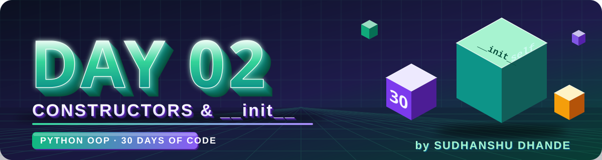
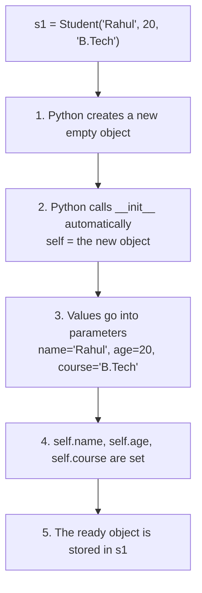
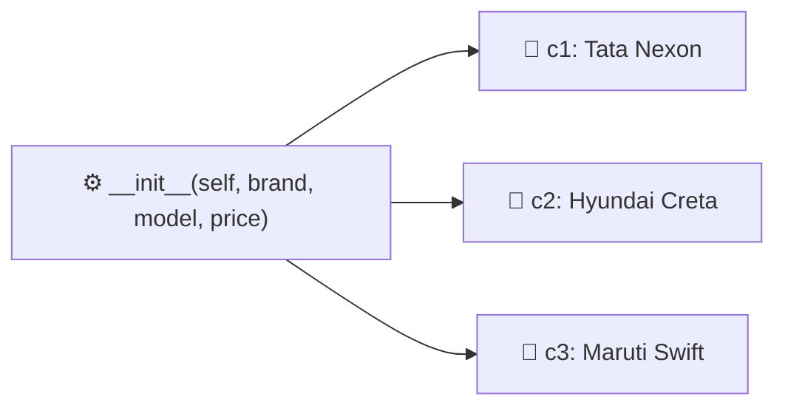

<p align="center">
  
</p>

<p align="center">
  
  
  
  
</p>

# 🟢 Day 02 — Constructors & `__init__`

## 🎯 Learning Objectives

Today I will learn:

* What is a constructor?
* What is `__init__()`?
* Why constructors are used
* How to initialize object data
* Constructor parameters
* Using `self` inside `__init__()`
* Creating multiple objects with different values
* Default values in constructors

---

# 📖 Day 02 Concepts — Read & Understand First

> Read this section slowly **before** solving the problems. Type every example yourself in VS Code and run it.

## 1️⃣ Recap: The Problem We Had on Day 01

On Day 01 we created an object first, and **then** set its data separately:

```python
class Student:
    def set_data(self, name, age):
        self.name = name
        self.age = age

s1 = Student()
s1.set_data("Rahul", 20)   # extra step — easy to forget!
```

What if we forget to call `set_data()`?

```python
s2 = Student()
print(s2.name)   # ❌ AttributeError: 'Student' object has no attribute 'name'
```

> 😕 The object exists, but it has **no data**. We want the data to be ready **the moment the object is created**. That is exactly what a **constructor** does.

---

## 2️⃣ What is a Constructor?

A **constructor** is a **special method that runs automatically when an object is created**. It is used to **initialize** (set up) the object's data.

> 🏭 **Analogy:** When a new phone is manufactured, the factory sets its name, color and storage **at the time of making** — you don't set them after buying. The constructor is that factory setup step.

In Python, the constructor is the method named:

```python
__init__()
```

* `__init__` is read as **"dunder init"** (dunder = **d**ouble **under**score).
* The name is **fixed** — you must write it exactly as `__init__` (two underscores on each side).
* It is called automatically — you **never** call it yourself.

---

## 3️⃣ Syntax of `__init__()`

```python
class ClassName:
    def __init__(self, parameter1, parameter2):
        self.attribute1 = parameter1
        self.attribute2 = parameter2
```

**Example:**

```python
class Student:
    def __init__(self, name, age, course):
        self.name = name
        self.age = age
        self.course = course

    def display(self):
        print(f"{self.name} | {self.age} | {self.course}")

s1 = Student("Rahul", 20, "B.Tech")   # __init__ runs automatically here
s1.display()                          # Rahul | 20 | B.Tech
```

📌 Notice: we passed values **while creating the object**, and the data was ready immediately. No separate `set_data()` call needed.

---

## 4️⃣ When is `__init__()` Called? (What Happens When an Object is Created)

When Python runs `s1 = Student("Rahul", 20, "B.Tech")`, these steps happen:



> 💡 The arguments you write inside `Student( ... )` are passed to `__init__`. You **do not** pass `self` — Python passes it for you.

---

## 5️⃣ `self` Inside `__init__()`

Inside `__init__`, `self` is the **new object that is being created**.

```python
self.name = name
#    ↑        ↑
#    |        └── constructor PARAMETER (temporary, exists only inside __init__)
#    └─────────── object ATTRIBUTE (saved inside the object, lives as long as the object)
```

| Term                  | Example     | Where it lives                     | Lifetime                  |
| --------------------- | ----------- | ---------------------------------- | ------------------------- |
| **Parameter**         | `name`      | Only inside the `__init__` method   | Until `__init__` finishes |
| **Attribute**         | `self.name` | Inside the object                  | As long as object exists  |

Why `self.name = name`?
→ It **copies** the value from the parameter into the object, so other methods (like `display()`) can use it later with `self.name`.

---

## 6️⃣ Multiple Objects, Different Values

One constructor can create **many objects**, each with **its own values**.

```python
class Car:
    def __init__(self, brand, model, price):
        self.brand = brand
        self.model = model
        self.price = price

    def show(self):
        print(self.brand, self.model, self.price)

c1 = Car("Tata", "Nexon", 900000)
c2 = Car("Hyundai", "Creta", 1200000)
c3 = Car("Maruti", "Swift", 700000)

c1.show()   # Tata Nexon 900000
c2.show()   # Hyundai Creta 1200000
c3.show()   # Maruti Swift 700000
```



---

## 7️⃣ Default Values (Default Parameters)

A parameter can have a **default value**. If the caller doesn't pass it, the default is used.

```python
class Student:
    def __init__(self, name, age=18, course="B.Tech"):
        self.name = name
        self.age = age
        self.course = course

s1 = Student("Rahul")                    # age=18, course="B.Tech" (defaults)
s2 = Student("Priya", 21)                # course="B.Tech" (default)
s3 = Student("Amit", 22, "MCA")          # no defaults used
s4 = Student("Neha", course="BBA")       # keyword argument: age stays 18
```

📌 **Rules**

* Parameters **with** defaults must come **after** parameters **without** defaults.
  ```python
  def __init__(self, name, age=18)    # ✅ correct
  def __init__(self, age=18, name)    # ❌ SyntaxError
  ```
* You can pass values **by keyword** (`course="BBA"`) to skip some defaults.

A very common real-life use: a bank account that starts with `balance = 0`.

```python
class BankAccount:
    def __init__(self, holder, balance=0):
        self.holder = holder
        self.balance = balance
```

---

## 8️⃣ A Constructor Can Also Contain Logic

`__init__` is a normal function, so you can calculate things or set starting values inside it.

```python
class Rectangle:
    def __init__(self, length, width):
        self.length = length
        self.width = width
        self.area = length * width      # calculated once, at creation

r = Rectangle(5, 3)
print(r.area)   # 15
```

You can also set attributes that **don't come from parameters**:

```python
class Counter:
    def __init__(self):
        self.count = 0      # every new Counter starts from 0
```

---

## 9️⃣ Method Data vs `__init__` Data

| Point                  | Setting data in a normal method (`set_data`) | Setting data in `__init__`            |
| ---------------------- | -------------------------------------------- | ------------------------------------- |
| When it runs           | Only when **you call** it                    | **Automatically** at object creation  |
| Can you forget it?     | ✅ Yes → object may have no data              | ❌ No → data is always ready           |
| Code style             | `obj = Student()` then `obj.set_data(...)`   | `obj = Student(...)` — one step       |
| Typical use            | Update data later                            | Set the **starting** data             |

> ✅ **Best practice:** use `__init__` to set up the object's data, and use normal methods for actions and later updates.

---

## 🔟 Important Points to Remember

* The constructor name is always `__init__` (exactly).
* The **first parameter** is always `self`.
* `__init__` is called **automatically** once for every new object.
* `__init__` should **not return a value** (it returns `None`). Writing `return 5` inside it causes an error.
* A class can have **only one** `__init__` in Python (the last one defined wins).
* If you don't write `__init__`, Python uses a default empty one — which is why Day 01 code worked without it.

---

## 1️⃣1️⃣ Common Mistakes (Avoid These!)

| ❌ Mistake                                              | ✅ Fix                                                |
| ------------------------------------------------------ | ---------------------------------------------------- |
| Writing `_init_` or `init` instead of `__init__`        | Use **two** underscores on both sides: `__init__`    |
| Forgetting `self` → `def __init__(name, age):`          | `def __init__(self, name, age):`                     |
| Writing `name = name` inside `__init__`                 | `self.name = name` (otherwise nothing is saved)      |
| Passing fewer values: `Student("Rahul")` (no defaults)  | Pass all required values → else `TypeError`          |
| Passing `self` while creating: `Student(self, "Rahul")` | Don't pass `self`: `Student("Rahul")`                |
| Default parameter before a non-default one              | Put default parameters at the **end**                |
| Calling `s1.__init__(...)` manually                     | Not needed — it runs automatically                   |

**Example of the most common error:**

```python
class Student:
    def __init__(self, name, age):
        self.name = name
        self.age = age

s1 = Student("Rahul")
# TypeError: __init__() missing 1 required positional argument: 'age'
```

---

## 📌 Day 02 in One Look

```text
Constructor  →  Special method that runs automatically   →  __init__(self, ...)
When called  →  The moment an object is created          →  s1 = Student("Rahul", 20)
self         →  The new object being built               →  self.name = name
Parameter    →  Temporary value passed in                →  name
Attribute    →  Value stored inside the object           →  self.name
Default      →  Value used when none is passed           →  age=18
```

---

# 📚 Theory Checklist

Before solving the problems, I should be able to answer:

1. What is a constructor?
2. What is `__init__()`?
3. When is `__init__()` called?
4. Why do we use `self` inside `__init__()`?
5. What is the difference between an attribute and a constructor parameter?
6. Can a constructor accept multiple parameters?
7. Can multiple objects have different values?
8. What is a default parameter?
9. What happens when an object is created?
10. What is the difference between defining data inside a method and initializing it through `__init__()`?

---

# 🧩 Day 02 Practice — 15 Problems

## 🟢 Level 1 — Basic Constructor Practice

### Q1. Student Class

Create a `Student` class with a constructor that accepts:

* `name`
* `age`
* `course`

Create one object and display all details.

---

### Q2. Employee Class

Create an `Employee` class with a constructor that accepts:

* `name`
* `salary`
* `department`

Create an object and display the employee details.

---

### Q3. Car Class

Create a `Car` class with a constructor that accepts:

* `brand`
* `model`
* `price`

Create one object and display its details.

---

### Q4. Book Class

Create a `Book` class with a constructor that accepts:

* `title`
* `author`
* `price`

Create one object and display the book information. 

---

### Q5. Mobile Class

Create a `Mobile` class with a constructor that accepts:

* `brand`
* `model`
* `price`
* `storage`

Create one object and display all details.

---

# 🟡 Level 2 — Multiple Objects

### Q6. Multiple Students

Create a `Student` class using a constructor.

Create **three different student objects** with different:

* names
* ages
* marks

Display the details of all three students.

**Goal:** Understand how one constructor can initialize different objects with different values.

---

### Q7. Product Inventory

Create a `Product` class with:

* `name`
* `price`
* `quantity`

Use the constructor to initialize the values.

Create three products.

Create a method:

```text
total_price()
```

which calculates:

```text
price × quantity
```

Display the total price of each product.

---

### Q8. Bank Account

Create a `BankAccount` class with a constructor containing:

* `account_holder`
* `account_number`
* `balance`

Create methods:

```text
deposit(amount)
withdraw(amount)
display_balance()
```

Create one account and test all methods.

---

### Q9. Rectangle

Create a `Rectangle` class.

The constructor should accept:

* `length`
* `width`

Create methods:

```text
area()
perimeter()
```

Formulas:

```text
Area = length × width

Perimeter = 2 × (length + width)
```

---

### Q10. Circle

Create a `Circle` class.

The constructor should accept:

* `radius`

Create methods:

```text
area()
circumference()
```

Use:

```text
Area = π × r²

Circumference = 2 × π × r
```

---

# 🔴 Level 3 — Logic Building

### Q11. Student Result

Create a `Student` class with a constructor containing:

* `name`
* `maths`
* `physics`
* `chemistry`

Create methods:

```text
total()
average()
percentage()
grade()
```

Grade rules:

```text
90+  → A
75+  → B
60+  → C
50+  → D
Below 50 → Fail
```

Display the complete result.

---

### Q12. Employee Salary

Create an `Employee` class with:

* `name`
* `basic_salary`

Create methods:

```text
monthly_salary()
annual_salary()
bonus()
final_annual_salary()
```

Assume the bonus is **10% of the annual salary**.

---

### Q13. Shopping Cart Product

Create a `Product` class with:

* `name`
* `price`
* `quantity`

Create methods:

```text
total_price()
discount()
final_price()
```

Rules:

```text
Total > ₹5000 → 10% discount
Total > ₹10000 → 20% discount
Otherwise → No discount
```

Display:

```text
Product Name
Quantity
Total Price
Discount
Final Price
```

---

### Q14. Temperature Converter

Create a `Temperature` class with:

* `celsius`

Create methods:

```text
to_fahrenheit()
to_kelvin()
```

Formulas:

```text
Fahrenheit = (Celsius × 9/5) + 32

Kelvin = Celsius + 273.15
```

Create two different temperature objects and compare their results.

---

### Q15. Bank Account Validation

Create a `BankAccount` class with:

* `account_holder`
* `account_number`
* `balance`

Create methods:

```text
deposit(amount)
withdraw(amount)
check_balance()
```

Rules:

* Deposit amount must be greater than 0.
* Withdrawal amount must be greater than 0.
* Withdrawal should not be greater than the available balance.
* Display an appropriate message for invalid operations.

Test the program with different values.

---

# ⭐ Day 02 Challenge

## Employee Management

Create an `Employee` class using a constructor.

Attributes:

```text
name
employee_id
department
salary
```

Methods:

```text
display_details()
annual_salary()
apply_bonus()
```

Bonus rules:

```text
Salary < ₹30,000  → 15% bonus
Salary ₹30,000–₹60,000 → 10% bonus
Salary > ₹60,000 → 5% bonus
```

Create **at least 3 employee objects** and display their complete information.

---

# 🧠 Day 02 Concept Challenge

Without looking at your previous code, explain in your own words:

```text
Why do we use __init__()?

Why do we use self?

What happens when we create an object?

How can the same class create objects with different values?
```

Write the answers in `README.md`.

---

# 📁 Day 02 Folder

```text
Day02_Constructors/
│
├── banner.svg
├── practice.py
└── README.md
```

---

# 📊 Day 02 Target

| Task                     |               Target |
| ------------------------ | -------------------: |
| Theory                   |                    ✅ |
| Basic Problems           |                    5 |
| Multiple Object Problems |                    5 |
| Logic Problems           |                    5 |
| Challenge                |                    1 |
| Total Problems           | **15 + 1 Challenge** |

---

# 🚫 Rules

* Do not copy solutions.
* Try every problem yourself first.
* Use `__init__()` in every main question.
* Understand what `self` refers to.
* Create multiple objects wherever asked.
* Test your programs with different values.
* If stuck, first write the logic in simple English.
* Do not move to Day 3 until the constructor concept is clear.

---

# ✅ Completion Checklist

* [ ] Watched the required CodeWithHarry constructor video
* [ ] Understood `__init__()`
* [ ] Understood constructor parameters
* [ ] Understood `self`
* [ ] Solved Q1–Q5
* [ ] Solved Q6–Q10
* [ ] Solved Q11–Q15
* [ ] Completed Challenge
* [ ] Completed Concept Challenge
* [ ] Tested all programs
* [ ] Added code to GitHub
* [ ] Committed changes
* [ ] Pushed to GitHub

---

## 🚀 GitHub Commit

```bash
git add .
git commit -m "Day 02: Constructors and init practice"
git push
```

---

<p align="center">
  
</p>

<h3 align="center"><b>Sudhanshu Dhande</b></h3>
<p align="center"><i>B.Tech (AI &amp; ML) · BATU, Lonere · Python OOP Journey</i></p>