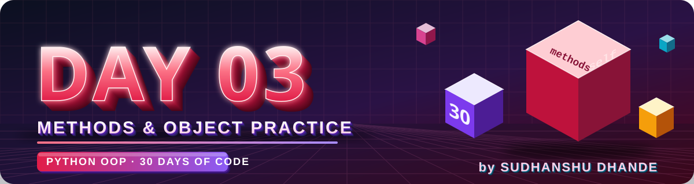

<p align="center">
  
</p>

<p align="center">
  
  
  
  
</p>

# 🟢 Day 03 — Constructor, Methods & Object Practice

## 🎯 Learning Objectives

Today I will practice:

* `class`
* Objects
* `__init__()`
* Constructor parameters
* `self`
* Instance attributes
* Instance methods
* Multiple objects
* Methods using object data
* Basic decision-making inside methods
* Combining multiple OOP concepts

> **Today is a practice-heavy day.**
> The goal is to solve problems independently rather than learning many new concepts.

---

# 📖 Day 03 Concepts — Read & Understand First

> Day 03 has **no new syntax**. Today we learn how to **think in OOP** and **combine** what we already know. Read this section, then type every example yourself in VS Code.

## 1️⃣ Quick Recap (Day 01 + Day 02)

| Concept         | One-line meaning                                      | Example                          |
| --------------- | ----------------------------------------------------- | -------------------------------- |
| **Class**       | Blueprint for objects                                 | `class Student:`                 |
| **Object**      | A real instance made from the class                   | `s1 = Student("Rahul", 20)`      |
| **`__init__`**  | Constructor — runs automatically when an object is made | `def __init__(self, name, age):` |
| **`self`**      | The current object                                    | `self.name = name`               |
| **Attribute**   | Variable stored inside an object                      | `self.age`                       |
| **Method**      | Function inside a class                               | `def display(self):`             |

---

## 2️⃣ How to Turn a Real-World Problem into a Class

Every problem today is a **real-world situation**. Use this simple trick:

> 🔎 **Nouns → Class & Attributes**  |  **Verbs (actions) → Methods**

**Example problem:** *"A parking ticket has a vehicle number and hours parked. It can calculate the charge and print a receipt."*

| Question to ask yourself            | Answer from the problem        |
| ----------------------------------- | ------------------------------ |
| What is the **thing**? → Class      | `Ticket`                       |
| What **data** does it hold? → Attributes | `vehicle_number`, `hours` |
| What can it **do**? → Methods       | `calculate_charge()`, `display_receipt()` |

**Skeleton to start every problem:**

```python
class ClassName:
    def __init__(self, attribute1, attribute2):
        self.attribute1 = attribute1
        self.attribute2 = attribute2

    def some_method(self):
        # use self.attribute1, self.attribute2 here
        pass

# create objects and test
obj = ClassName(value1, value2)
obj.some_method()
```

📌 Follow the **Difficulty Rule** given later in this file: *Understand → Attributes → Class → `__init__` → Methods → Objects → Test.*

---

## 3️⃣ Methods Use Object Data Through `self`

A method can read (and change) the object's data using `self`.

```python
class Box:
    def __init__(self, length, width, height):
        self.length = length
        self.width = width
        self.height = height

    def volume(self):
        return self.length * self.width * self.height

b1 = Box(2, 3, 4)
b2 = Box(5, 5, 5)

print(b1.volume())   # 24
print(b2.volume())   # 125
```

Same method, **different results** — because `self` points to a different object each time.

A method can also take **extra parameters** besides `self`:

```python
class Box:
    ...
    def scale(self, factor):          # factor is an extra parameter
        return self.volume() * factor
```

---

## 4️⃣ `return` vs `print()` Inside Methods

| Style                    | Use it when…                                    | Example                                        |
| ------------------------ | ----------------------------------------------- | ---------------------------------------------- |
| `return value`           | The method **calculates** something             | `area()`, `total()`, `grade()`, `final_price()` |
| `print(...)`             | The method is meant to **display** something    | `display_info()`, `display_details()`          |

```python
def area(self):
    return self.length * self.width        # ✅ returns the value

def display_info(self):
    print("Length:", self.length)          # ✅ only displays
```

> ✅ **Best practice:** calculation methods **return** the result, and you **print outside** the method: `print(r1.area())`.
> ⚠️ If a method only prints and has no `return`, then `x = obj.method()` gives `None`.

---

## 5️⃣ One Method Can Call Another Method (`self.method()`)

Big methods become easier when you build them from small methods. To call a method of the **same object**, use `self.`:

```python
class ElectricityBill:
    def __init__(self, units, rate):
        self.units = units
        self.rate = rate

    def energy_charge(self):
        return self.units * self.rate

    def fixed_charge(self):
        return 100

    def total_bill(self):
        return self.energy_charge() + self.fixed_charge()   # calling other methods

bill = ElectricityBill(200, 6)
print(bill.total_bill())   # 1300
```

📌 Writing just `energy_charge()` (without `self.`) gives `NameError`. Always write `self.energy_charge()`.

> 💡 This is the key idea behind problems like `total() → average() → percentage() → grade() → result()`: each method **builds on the previous one**.

---

## 6️⃣ Decision-Making Inside Methods (`if` / `elif` / `else`)

Many methods need rules (slabs, discounts, grades). Use `if / elif / else`:

```python
class Parcel:
    def __init__(self, weight):
        self.weight = weight

    def delivery_charge(self):
        if self.weight > 10:
            return 200
        elif self.weight > 5:
            return 100
        else:
            return 50

print(Parcel(12).delivery_charge())   # 200
print(Parcel(7).delivery_charge())    # 100
print(Parcel(2).delivery_charge())    # 50
```

### ⚠️ Order of conditions matters!

Python checks conditions **from top to bottom** and stops at the first one that is `True`.

```python
# ❌ WRONG ORDER — a weight of 12 matches "> 5" first
if self.weight > 5:
    return 100
elif self.weight > 10:      # never reached!
    return 200
```

> ✅ **Rule:** for "greater than / greater than or equal" slabs, check the **largest limit first**.
> ✅ For "less than" slabs, check the **smallest limit first**.

Range rules like `4–7 days` can be written with `elif days >= 4:` (after checking `days >= 8` first), or with `4 <= days <= 7`.

---

## 7️⃣ Validation Pattern (Checking Before Doing)

Real programs must **reject invalid input**. A clean way: check the bad cases first, show a message, and `return`.

```python
class Show:
    def __init__(self, name, seats_available):
        self.name = name
        self.seats_available = seats_available

    def book(self, seats):
        if seats <= 0:
            print("Invalid number of seats")
            return
        if seats > self.seats_available:
            print("Not enough seats available")
            return
        self.seats_available -= seats          # update object data
        print(f"{seats} seats booked. Remaining: {self.seats_available}")

s = Show("Movie Night", 10)
s.book(3)     # 3 seats booked. Remaining: 7
s.book(-1)    # Invalid number of seats
s.book(20)    # Not enough seats available
```

📌 Notice: the method **changes the object's data** (`self.seats_available -= seats`) only after all checks pass. Bank / ATM problems follow the same pattern.

---

## 8️⃣ Working With Multiple Objects

### a) Compare two objects

```python
b1 = Box(2, 3, 4)
b2 = Box(5, 5, 5)

if b1.volume() > b2.volume():
    print("b1 is bigger")
elif b1.volume() < b2.volume():
    print("b2 is bigger")
else:
    print("Both are equal")
```

### b) Store objects in a list and loop through them

```python
boxes = [Box(2, 3, 4), Box(5, 5, 5), Box(1, 1, 1)]

for b in boxes:
    print(b.volume())
```

### c) Find the largest / smallest (manual way)

```python
largest = boxes[0]
for b in boxes:
    if b.volume() > largest.volume():
        largest = b

print("Largest volume:", largest.volume())
```

> 💡 For the **smallest**, flip the `>` to `<`.
> 💡 You can also pass **another object into a method**: `def is_bigger_than(self, other):` and compare `self.volume() > other.volume()`.

### d) Average and counting with a list

```python
volumes = [b.volume() for b in boxes]     # or use a normal for loop
average = sum(volumes) / len(volumes)
```

* Count objects that satisfy a condition by keeping a counter inside the loop (`count += 1`).

---

## 9️⃣ Handling Marks Stored in a List

When an attribute holds many values (like marks of many subjects), store them in a **list**:

```python
class Exam:
    def __init__(self, name, marks):
        self.name = name
        self.marks = marks            # marks is a list, e.g. [80, 70, 90]

    def total(self):
        return sum(self.marks)

    def average(self):
        return sum(self.marks) / len(self.marks)

e = Exam("Test 1", [80, 70, 90])
print(e.total())      # 240
print(e.average())    # 80.0
```

* `sum(list)` → total of all values
* `len(list)` → number of values
* `max(list)` / `min(list)` → highest / lowest value

---

## 🔟 Percentage, Discount & GST Formulas

| Calculation                      | Formula                                       |
| -------------------------------- | --------------------------------------------- |
| Total of items                   | `price × quantity`                            |
| Discount amount                  | `total × discount_percent / 100`              |
| Price after discount             | `total − discount_amount`                     |
| GST amount                       | `amount × gst_percent / 100`                  |
| Final bill (with GST)            | `amount_after_discount + gst_amount`          |
| Percentage of marks              | `(marks obtained / total marks) × 100`        |
| Annual from monthly              | `monthly × 12`                                |

⚠️ Be careful about the **order**: if a question says *"after applying the discount, calculate GST"*, then GST is calculated on the **discounted** amount, not the original.

---

## 1️⃣1️⃣ Printing Money and Decimals Neatly

Use **f-strings** to format output:

```python
amount = 12345.6789

print(f"Amount: ₹{amount}")          # Amount: ₹12345.6789
print(f"Amount: ₹{amount:.2f}")      # Amount: ₹12345.68      (2 decimal places)
print(f"Amount: ₹{amount:,.2f}")     # Amount: ₹12,345.68     (with commas)
```

A neat bill layout:

```python
print("-" * 30)
print(f"{'Item':<15}{'Amount':>15}")
print("-" * 30)
```

---

## 1️⃣2️⃣ Common Mistakes (Avoid These!)

| ❌ Mistake                                              | ✅ Fix                                                   |
| ------------------------------------------------------ | ------------------------------------------------------- |
| Calling another method without `self.` → `total()`      | `self.total()`                                          |
| Using `print` inside a calculation method               | `return` the value, print outside                       |
| Forgetting `self.` before an attribute                  | `self.balance`, not `balance`                           |
| Wrong condition order in `if / elif`                    | Check the largest limit first                           |
| Using `=` instead of `==` in a condition                | `==` compares, `=` assigns                              |
| Not updating the balance after deposit / withdraw       | `self.balance += amount` / `self.balance -= amount`     |
| Doing the withdrawal **before** validation checks       | Validate first, change the balance last                 |
| Hard-coding values inside methods                       | Use attributes and parameters                           |
| Creating all objects with the same data while testing   | Test with **different** values, including edge cases   |
| Dividing by zero (e.g., empty marks list)               | Check `len(self.marks) > 0` first                       |

**🧪 Always test edge cases:** values exactly at the limit (e.g., exactly `5000`, exactly `90`), zero, negative numbers, and very large numbers.

---

## 1️⃣3️⃣ How to Debug a Problem Step by Step

1. **Read the error message** from bottom to top — the last line tells the error type.
2. Add `print()` to see the value of attributes at each step.
3. Check **indentation** (methods must be inside the class).
4. Check you wrote `self` in the method definition **and** `self.` when using attributes.
5. Run with a **simple example** you can calculate by hand and compare.
6. Still stuck? Write the logic in simple English first, then convert it to code.

---

## 📌 Day 03 in One Look

```text
Problem  →  Find the nouns (class + attributes) and verbs (methods)
Class    →  __init__ stores the data using self.attribute
Methods  →  Use self.attribute, return results, call other methods with self.method()
Decisions→  if / elif / else — largest limit first
Objects  →  Create many with different data, store in a list, loop, compare
Output   →  Test edge cases and format with f-strings
```

---

# 📚 Theory Checklist

Before starting the problems, I should be able to explain:

1. What is a class?
2. What is an object?
3. What is `self`?
4. What is `__init__()`?
5. Why do we use a constructor?
6. What is an instance variable?
7. What is an instance method?
8. How can different objects have different data?
9. How does a method access object data?
10. Why is OOP useful for organizing large programs?

---

# 🧩 Day 03 Practice — 15 Problems

## 🟢 Level 1 — Basic Practice

### Q1. Person Class

Create a `Person` class with:

* `name`
* `age`
* `city`

Use a constructor to initialize the values.

Create a method:

```text
display_info()
```

Display the person's complete information.

Create **3 objects** with different data.

---

### Q2. Laptop Class

Create a `Laptop` class with:

* `brand`
* `model`
* `ram`
* `price`

Create a method:

```text
display_details()
```

Create two laptop objects and display their details.

---

### Q3. Movie Class

Create a `Movie` class with:

* `title`
* `director`
* `rating`

Create a method:

```text
display_movie()
```

Create three movie objects and display their information.

---

### Q4. Employee Class

Create an `Employee` class with:

* `name`
* `department`
* `salary`

Create methods:

```text
display_details()
annual_salary()
```

Create two employees and display their annual salaries.

---

### Q5. Mobile Class

Create a `Mobile` class with:

* `brand`
* `model`
* `price`

Create a method:

```text
apply_discount(percent)
```

The method should calculate the discounted price.

Create one mobile object and apply a discount.

---

# 🟡 Level 2 — Logic Building

### Q6. Student Grade

Create a `Student` class with:

* `name`
* `marks`

Create a method:

```text
grade()
```

Rules:

```text
90+  → A
75–89 → B
60–74 → C
50–59 → D
Below 50 → Fail
```

Create three student objects and display their grades.

---

### Q7. Rectangle Comparison

Create a `Rectangle` class with:

* `length`
* `width`

Create a method:

```text
area()
```

Create two rectangle objects.

Compare their areas and display which rectangle has the larger area.

---

### Q8. Bank Account

Create a `BankAccount` class with:

* `account_holder`
* `balance`

Create methods:

```text
deposit(amount)
withdraw(amount)
check_balance()
```

Rules:

* Deposit must be positive.
* Withdrawal must be positive.
* Withdrawal cannot exceed the balance.

Test the account using multiple transactions.

---

### Q9. Product Discount

Create a `Product` class with:

* `name`
* `price`
* `quantity`

Create methods:

```text
total_price()
apply_discount()
final_price()
```

Discount rules:

```text
Total >= ₹10,000 → 20%
Total >= ₹5,000  → 10%
Otherwise        → 0%
```

Display the complete bill.

---

### Q10. Circle Comparison

Create a `Circle` class with:

* `radius`

Create a method:

```text
area()
```

Create three circle objects.

Find and display:

* Area of each circle
* Circle with the largest area
* Circle with the smallest area

---

# 🔴 Level 3 — Real-World Logic

### Q11. Employee Bonus System

Create an `Employee` class with:

* `name`
* `salary`
* `performance_score`

Create methods:

```text
calculate_bonus()
final_salary()
display_details()
```

Bonus rules:

```text
Score >= 90 → 20% bonus
Score >= 75 → 15% bonus
Score >= 60 → 10% bonus
Score < 60  → No bonus
```

Create at least **3 employees**.

---

### Q12. Student Result System

Create a `Student` class with:

* `name`
* `maths`
* `physics`
* `chemistry`
* `english`
* `computer`

Create methods:

```text
total()
average()
percentage()
grade()
result()
```

Result rules:

```text
Percentage >= 40 → Pass
Percentage < 40  → Fail
```

Grade:

```text
90+ → A+
80+ → A
70+ → B
60+ → C
50+ → D
Below 50 → F
```

Create at least **3 students**.

---

### Q13. Shopping Bill

Create a `Product` class with:

* `name`
* `price`
* `quantity`

Create methods:

```text
subtotal()
discount()
gst()
final_bill()
```

Rules:

```text
Subtotal >= ₹10,000 → 15% discount
Subtotal >= ₹5,000  → 10% discount
Otherwise            → No discount
```

After applying the discount, calculate **18% GST**.

Display a complete bill.

---

### Q14. Vehicle Rental System

Create a `Vehicle` class with:

* `vehicle_name`
* `vehicle_type`
* `price_per_day`

Create a method:

```text
calculate_rent(days)
```

Rules:

```text
1–3 days   → Normal price
4–7 days   → 10% discount
8+ days    → 20% discount
```

Create at least **3 vehicles** and calculate rental prices for different numbers of days.

---

### Q15. ATM Simulation

Create an `ATM` class with:

* `account_holder`
* `balance`

Create methods:

```text
deposit(amount)
withdraw(amount)
check_balance()
```

Add these rules:

* Deposit must be greater than 0.
* Withdrawal must be greater than 0.
* Withdrawal cannot exceed balance.
* Minimum balance after withdrawal should be ₹500.
* Display appropriate messages.

Test the program using multiple transactions.

---

# ⭐ Day 03 Challenge

## 🏫 College Student Management

Create a `Student` class.

### Attributes

```text
name
roll_number
branch
year
marks
```

Where `marks` contains marks for multiple subjects.

### Methods

```text
display_details()
total_marks()
percentage()
grade()
result()
```

### Requirements

Create at least **5 students**.

Find:

* Student with highest percentage
* Student with lowest percentage
* Average percentage of the class
* Number of students who passed
* Number of students who failed

### Bonus Challenge

Create a method:

```text
is_topper()
```

that identifies whether the student has the highest percentage.

---

# 🧠 Concept Challenge

Answer these questions **without looking at your code**:

### 1.

What is the difference between:

```text
Class
Object
Instance Variable
Instance Method
```

### 2.

Why do we write:

```python
self.name = name
```

instead of only:

```python
name = name
```

### 3.

If we create:

```text
student1
student2
student3
```

from the same class, why can each object contain different values?

### 4.

What happens when this is executed?

```text
Student("Rahul", 20)
```

Explain the process in your own words.

---

# 📁 Day 03 Folder

```text
Day03_Constructor_Object_Practice/
│
├── banner.svg
├── README.md
├── Q01.py
├── Q02.py
├── ...
├── Q15.py
└── Q16_Challenge.py
```

> Use two-digit file names (`Q01`, `Q02`, … `Q15`) so GitHub shows them in the correct order.

---

# 📊 Day 03 Target

| Task                |               Target |
| ------------------- | -------------------: |
| Theory              |                    ✅ |
| Basic Problems      |                    5 |
| Logic Problems      |                    5 |
| Real-World Problems |                    5 |
| Challenge           |                    1 |
| Concept Questions   |                    4 |
| Total Problems      | **15 + 1 Challenge** |

---

# 🚫 Rules

* Do not copy solutions.
* Use `__init__()` in every main problem.
* Use methods instead of writing everything outside the class.
* Create multiple objects where required.
* Try every problem before asking for help.
* If stuck, first write the logic in simple English.
* Do not use advanced OOP concepts yet.
* Do not use inheritance, decorators, getters/setters, class methods, or static methods.
* Focus only on the concepts learned so far.

---

# 🔥 Difficulty Rule

For every problem:

```text
Understand the question
        ↓
Identify attributes
        ↓
Create the class
        ↓
Create __init__()
        ↓
Create required methods
        ↓
Create objects
        ↓
Test with different values
        ↓
Check the output
```

---

# ✅ Completion Checklist

* [ ] Revised Classes & Objects
* [ ] Revised `self`
* [ ] Revised `__init__()`
* [ ] Solved Q1–Q5
* [ ] Solved Q6–Q10
* [ ] Solved Q11–Q15
* [ ] Completed Challenge
* [ ] Answered Concept Questions
* [ ] Tested all programs
* [ ] Cleaned the code
* [ ] Added comments where required
* [ ] Added work to GitHub
* [ ] Committed changes
* [ ] Pushed to GitHub

---

## 🚀 GitHub Commit

```bash
git add .
git status
git commit -m "Day 03: Constructor and Object practice"
git push
```

---

## 🎯 Day 03 Goal

> **I should be able to create a class from a real-world problem, decide its attributes and methods, use a constructor to initialize objects, and solve the problem without copying code.**

---

<p align="center">
  
</p>

<h3 align="center"><b>Sudhanshu Dhande</b></h3>
<p align="center"><i>B.Tech(AI &amp; ML) · BATU, Lonere · Python OOP Journey</i></p>