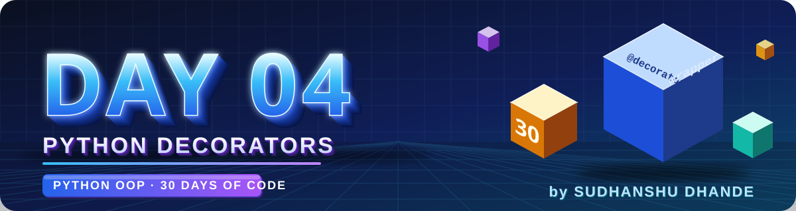
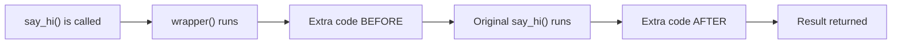

<p align="center">
  
</p>

<p align="center">
  
  
  
  
</p>

# 🟢 Day 04 — Python Decorators

## 🎯 Learning Objectives

Today I will learn:

* What is a decorator in Python?
* Why do we use decorators?
* What is a function inside another function?
* What is a wrapper function?
* How to pass a function as an argument
* How to return a function from another function
* How to use `@decorator_name` syntax
* How decorators work with parameters
* How to use decorators with class methods
* How to preserve function information using `functools.wraps`

---

# 📖 Day 04 Concepts — Read & Understand First

> Decorators look confusing at first because they use **three ideas together**: functions as objects, functions inside functions, and returning functions. We will learn them **one by one**. Type every example yourself in VS Code and run it.

## 1️⃣ Why Do We Need Decorators?

Imagine you have many functions and you want to **add the same extra behavior** to all of them — for example:

* print a log message before the function runs
* check if the user is logged in
* measure how long the function takes

Without decorators you would **copy-paste** the same lines inside every function. That is messy and hard to change.

> 🎁 **Analogy:** A decorator is like **gift wrapping**. The gift (your function) stays the same. The wrapping (extra behavior) is added **around** it, without opening or changing the gift.

> ✅ A **decorator** adds new functionality to an existing function **without changing the function's own code**.

---

## 2️⃣ Step 1 — Functions Are Objects in Python

In Python, a function is a **value** like a number or a string. You can:

**a) Store a function in a variable**

```python
def shout(text):
    return text.upper()

yell = shout            # no brackets → we are NOT calling it, just giving it a second name
print(yell("hi"))       # HI
```

**b) Pass a function as an argument to another function**

```python
def apply(func, value):
    return func(value)

print(apply(shout, "hello"))   # HELLO
```

**c) Return a function from another function**

```python
def get_operation():
    def square(x):
        return x * x
    return square            # returning the function itself (no brackets)

op = get_operation()
print(op(5))                 # 25
```

> 🔑 **`func` vs `func()`:**
> `func` → the function itself (an object).
> `func()` → **calls** the function and gives its result.

A function that **takes a function** and/or **returns a function** is called a **higher-order function**.

---

## 3️⃣ Step 2 — A Function Inside Another Function

You can define a function **inside** another function. The inner function can use the outer function's variables.

```python
def outer():
    msg = "Hello"

    def inner():
        print(msg)          # inner can use msg of outer

    return inner

f = outer()
f()                          # Hello
```

Even after `outer()` has finished, `inner` **remembers** `msg`. (This is called a *closure*.)

---

## 4️⃣ Step 3 — What is a Decorator?

A **decorator** is a higher-order function that:

1. **takes a function** as input,
2. defines an inner **wrapper function** that adds extra code around it,
3. **returns the wrapper**.

```python
def my_decorator(func):              # 1. takes a function
    def wrapper():                   # 2. wrapper adds extra behavior
        print("Before")
        func()                       #    the original function runs here
        print("After")
    return wrapper                   # 3. returns the wrapper (no brackets!)

def say_hi():
    print("Hi!")

say_hi = my_decorator(say_hi)        # decorating manually
say_hi()
```

**Output:**

```text
Before
Hi!
After
```

What happened?



> 💡 After `say_hi = my_decorator(say_hi)`, the name `say_hi` now points to **`wrapper`**, which contains the original function inside it.

---

## 5️⃣ The `@` Syntax (Shortcut)

Writing `say_hi = my_decorator(say_hi)` every time is boring. Python gives a shortcut:

```python
@my_decorator
def say_hi():
    print("Hi!")
```

These two are **exactly the same**:

| Long way                         | Short way (`@`)          |
| -------------------------------- | ------------------------ |
| `say_hi = my_decorator(say_hi)`  | `@my_decorator` above the function |

📌 `@my_decorator` goes **just above** the `def` line. It is **not** `@my_decorator()` — no brackets for a normal decorator.

---

## 6️⃣ When Does Each Part Run?

Two different moments:

* The **decorator function** runs **once**, when the function is defined.
* The **wrapper** runs **every time** the decorated function is called.

```python
def deco(func):
    print("Decorating", func.__name__)       # runs once

    def wrapper(*args, **kwargs):
        print("Calling", func.__name__)      # runs every call
        return func(*args, **kwargs)
    return wrapper

@deco
def hello():
    print("Hello")

print("--- calling twice ---")
hello()
hello()
```

**Output:**

```text
Decorating hello
--- calling twice ---
Calling hello
Hello
Calling hello
Hello
```

---

## 7️⃣ Decorators with Function Arguments — `*args` and `**kwargs`

Real functions take arguments. But the decorator does not know in advance **how many** or **which**. So the wrapper accepts **anything** and passes it on:

```python
def log_call(func):
    def wrapper(*args, **kwargs):
        print(f"Calling {func.__name__} with {args} {kwargs}")
        result = func(*args, **kwargs)
        print(f"Returned {result}")
        return result
    return wrapper

@log_call
def multiply(a, b):
    return a * b

multiply(3, 4)
multiply(a=2, b=5)
```

**Output:**

```text
Calling multiply with (3, 4) {}
Returned 12
Calling multiply with () {'a': 2, 'b': 5}
Returned 10
```

| Symbol      | Inside the wrapper definition            | When calling `func(...)`              |
| ----------- | ---------------------------------------- | ------------------------------------- |
| `*args`     | **Collects** all positional arguments into a tuple | **Unpacks** the tuple back into arguments |
| `**kwargs`  | **Collects** all keyword arguments into a dictionary | **Unpacks** the dictionary back into arguments |

> ✅ Using `*args, **kwargs` makes **one decorator work with any function**.

---

## 8️⃣ Don't Forget to `return` the Result

If the wrapper calls the function but does not `return` its result, the decorated function gives `None`:

```python
def bad(func):
    def wrapper(*args, **kwargs):
        func(*args, **kwargs)        # ❌ result is thrown away
    return wrapper

@bad
def add(a, b):
    return a + b

print(add(2, 3))   # None   ← expected 5
```

**Fix:** `return func(*args, **kwargs)`

A decorator can also **change** the result before returning it:

```python
def round_result(func):
    def wrapper(*args, **kwargs):
        result = func(*args, **kwargs)
        return round(result, 2)        # modify the returned value
    return wrapper

@round_result
def average(a, b, c):
    return (a + b + c) / 3

print(average(1, 2, 2))   # 1.67
```

---

## 9️⃣ Deciding Whether the Function Should Run

A decorator can **check a condition** and run the function **only if** the condition is true (login check, validation, permission, etc.):

```python
tickets_available = True

def check_tickets(func):
    def wrapper(*args, **kwargs):
        if tickets_available:
            return func(*args, **kwargs)     # allowed → run original
        print("Sold out")                    # not allowed → skip original
    return wrapper

@check_tickets
def book_ticket(name):
    print(f"Ticket booked for {name}")

book_ticket("Rahul")          # Ticket booked for Rahul

tickets_available = False
book_ticket("Priya")          # Sold out
```

---

## 🔟 Decorators with Class Methods

A normal method's **first argument is `self`**. The wrapper simply passes everything through, so it works for methods too.

```python
def log_method(func):
    def wrapper(self, *args, **kwargs):
        print(f"Running {func.__name__} on {self.name}")
        return func(self, *args, **kwargs)
    return wrapper

class Printer:
    def __init__(self, name):
        self.name = name

    @log_method
    def print_pages(self, pages):
        print(f"{self.name} printed {pages} pages")

p = Printer("HP-1")
p.print_pages(5)
```

**Output:**

```text
Running print_pages on HP-1
HP-1 printed 5 pages
```

📌 **Two ways to write the wrapper for methods:**

* `def wrapper(self, *args, **kwargs):` → you can use `self` directly (as above).
* `def wrapper(*args, **kwargs):` → also works, and `self` is simply `args[0]`. Use this when the decorator should work for **both** normal functions and methods.

> 🔗 **Why this matters for OOP:** `@staticmethod`, `@classmethod` and `@property` (coming in the next days) are all **decorators**.

---

## 1️⃣1️⃣ `functools.wraps` — Keep the Original Function's Identity

After decoration, the function's name and docstring are replaced by the wrapper's:

```python
def nowraps(func):
    def wrapper(*args, **kwargs):
        return func(*args, **kwargs)
    return wrapper

@nowraps
def add_one(x):
    """Adds one."""
    return x + 1

print(add_one.__name__)   # wrapper    ← not add_one!
print(add_one.__doc__)    # None       ← docstring lost
```

**Fix with `functools.wraps`:**

```python
from functools import wraps

def with_wraps(func):
    @wraps(func)                      # copies name, docstring, etc. from func
    def wrapper(*args, **kwargs):
        return func(*args, **kwargs)
    return wrapper

@with_wraps
def add_one(x):
    """Adds one."""
    return x + 1

print(add_one.__name__)   # add_one
print(add_one.__doc__)    # Adds one.
```

> ✅ **Best practice:** always add `@wraps(func)` on top of the wrapper. It helps debugging and documentation tools.

---

## 1️⃣2️⃣ Optional Preview (Not Required Today)

**a) Decorators that take their own arguments** need **one more level** of nesting:

```python
def tag(name):                         # level 1: takes the decorator's argument
    def decorator(func):               # level 2: takes the function
        def wrapper(*args, **kwargs):  # level 3: the wrapper
            return f"<{name}>{func(*args, **kwargs)}</{name}>"
        return wrapper
    return decorator

@tag("b")                              # note the brackets here
def hello():
    return "Hello"

print(hello())    # <b>Hello</b>
```

**b) Stacking decorators** — the one **closest to the function** is applied first:

```python
@tag("b")
@tag("i")
def hello():
    return "Hello"

print(hello())    # <b><i>Hello</i></b>
```

---

## 1️⃣3️⃣ Where Decorators Are Used in Real Life

| Use case                | Example                                          |
| ----------------------- | ------------------------------------------------ |
| Logging                 | Print which function ran and with what arguments |
| Authentication          | Allow only logged-in users to open a page        |
| Timing / performance    | Measure how long a function takes                |
| Validation              | Check inputs before running                      |
| Caching                 | Remember results (`functools.lru_cache`)         |
| Web frameworks          | Flask routes use `@app.route(...)`               |
| Python built-ins        | `@property`, `@staticmethod`, `@classmethod`     |

---

## 1️⃣4️⃣ Common Mistakes (Avoid These!)

| ❌ Mistake                                              | ✅ Fix                                                    |
| ------------------------------------------------------ | -------------------------------------------------------- |
| Writing `return wrapper()` in the decorator             | `return wrapper` — **no brackets**, we return the function itself |
| Not returning the function's result in the wrapper      | `return func(*args, **kwargs)`                           |
| Wrapper takes no parameters, but the function has some  | Use `def wrapper(*args, **kwargs):`                      |
| Writing `@my_decorator()` for a normal decorator        | `@my_decorator` (brackets only if the decorator takes its own arguments) |
| Putting `@decorator` **below** the `def` line           | It must be **directly above** the function               |
| Forgetting to call the original function inside wrapper | Call `func(...)` inside the wrapper                      |
| Forgetting `@wraps(func)`                               | Add `from functools import wraps` and use it             |
| Forgetting `self` when decorating a method              | Use `wrapper(self, *args, **kwargs)` or `*args`          |
| Mixing up decorator and wrapper                         | Decorator = outer function (takes `func`). Wrapper = inner function (runs each time). |

---

## 📌 Day 04 in One Look

```text
Decorator  →  Function that takes a function, adds behavior, returns a new function
Wrapper    →  Inner function that runs before/after the original function
@name      →  Shortcut for   func = name(func)
*args      →  Collects any positional arguments
**kwargs   →  Collects any keyword arguments
return     →  Wrapper must return the original function's result
wraps      →  Keeps original __name__ and __doc__
```

**Template to remember:**

```python
from functools import wraps

def my_decorator(func):
    @wraps(func)
    def wrapper(*args, **kwargs):
        # code BEFORE
        result = func(*args, **kwargs)
        # code AFTER
        return result
    return wrapper
```

---

## 📚 Theory Checklist

Before solving the problems, I should be able to answer:

1. What is a decorator?
2. Why are decorators useful?
3. What is a higher-order function?
4. Can we pass a function as an argument to another function?
5. What is a wrapper function?
6. What does `@decorator_name` mean?
7. What is the difference between calling a decorator and decorating a function?
8. How can a decorator execute code before and after a function?
9. How can a decorator work with function arguments?
10. What is the purpose of `*args` and `**kwargs` in decorators?
11. What is `functools.wraps`?
12. Can we use decorators with class methods?

---

## 🧩 Day 04 Practice — 15 Problems

### 🟢 Level 1 — Decorator Fundamentals

#### Q1. First Decorator

Create a decorator named `my_decorator`.

It should print `"Function is starting"` before the original function runs.

Create a function named `greet()` that prints `"Hello, Python!"`.

Apply your decorator to `greet()`.

#### Q2. Before and After

Create a decorator that prints:

* `"Before function"`
* Executes the original function
* `"After function"`

Test it using a function named `welcome()`.

#### Q3. Function Execution Counter

Create a decorator that prints `"Function executed"` whenever the decorated function is called.

Apply it to a function named `say_hello()`.

Call the function three times.

#### Q4. Uppercase Message

Create a decorator that calls a function returning a string and prints the returned string in uppercase.

Test it with a function returning `"python oop practice"`.

#### Q5. Function Information

Create a decorator that prints the name of the function being called.

Test it with two different functions.

---

### 🟡 Level 2 — Logic Building

#### Q6. Addition Decorator

Create a decorator that prints a message before an addition function runs.

Your function should accept two numbers and return their sum.

Test with different numbers.

#### Q7. Execution Time Message

Create a decorator that prints `"Starting task"` before a function and `"Task completed"` after it.

Apply it to a function that prints numbers from 1 to 5.

*Goal: Understand the structure used for timing or monitoring tasks. Actual time measurement is optional.*

#### Q8. Login Required

Create a decorator named `login_required`.

Create a function `dashboard()` that prints `"Welcome to Dashboard"`.

If the user is logged in, allow the function to run. Otherwise, print `"Please log in first"`.

Use a Boolean variable to represent login status.

#### Q9. Positive Number Validation

Create a decorator that checks whether a function's number argument is positive.

If the number is positive, execute the function. Otherwise, print `"Number must be positive"`.

Test with positive, zero, and negative values.

#### Q10. Repeat Function

Create a decorator that executes a function **three times** whenever it is called once.

Test it with a function that prints `"Practice makes progress"`.

---

### 🔴 Level 3 — Decorators with Arguments

#### Q11. Flexible Decorator

Create a decorator that works with functions accepting different numbers of positional and keyword arguments.

Use `*args` and `**kwargs` in the wrapper.

Test it with:

* A function accepting two numbers
* A function accepting a name and city

#### Q12. Calculator Decorator

Create a decorator that prints `"Calculating..."` before a calculator function executes.

Create functions for:

* Addition
* Subtraction
* Multiplication
* Division

Handle division by zero appropriately.

#### Q13. Discount Decorator

Create a decorator for a product-price function.

The decorator should apply a **10% discount** to the price returned by the original function.

Test it with at least two different product prices.

#### Q14. Student Result Decorator

Create a `Student` class with:

* `name`
* `marks`

Create a method named `display_result()`.

Use a decorator to print `"Student Result"` before the method executes.

Create three student objects and display their results.

#### Q15. Preserve Function Details

Create a decorator and apply it to a function named `student_details()`.

Use `functools.wraps` so the decorated function retains its original name and documentation.

Check the function's `__name__` and `__doc__`.

---

## ⭐ Day 04 Challenge — Employee Performance Tracker

Create a decorator named `performance_tracker`.

It should print:

* `"Employee task started"`
* Execute the decorated function
* `"Employee task completed"`

Create an `Employee` class with:

* `name`
* `department`
* `tasks_completed`

Create a method named `complete_task()` and apply the decorator to it.

Create at least three employee objects and test the method.

**Bonus:** Make the decorator work with methods that accept arguments, without losing the original function's return value.

---

## 🧠 Concept Challenge

Answer these questions in your own words:

1. Why do we use decorators?
2. What is a wrapper function?
3. What happens when we write `@my_decorator` above a function?
4. Why do decorators often use `*args` and `**kwargs`?
5. How can a decorator add functionality without changing the original function's code?

Write your answers in this README.

---

## 📁 Day 04 Folder Structure

```text
Day04_Decorators/
│
├── banner.svg
├── README.md
├── Q01.py
├── Q02.py
├── ...
├── Q15.py
└── Q16_Challenge.py
```

Keep your solutions organized with a comment at the top of each file, such as `# Q1`, `# Q2`, and so on.

> Use two-digit file names (`Q01`, `Q02`, … `Q15`) so GitHub shows them in the correct order.

---

## 📊 Day 04 Target

| Task                       |           Target |
| -------------------------- | ---------------: |
| Theory questions           |               12 |
| Basic problems             |                5 |
| Logic-building problems    |                5 |
| Advanced practice problems |                5 |
| Main challenge             |                1 |
| Total practice problems    | 15 + 1 challenge |

---

## 🚫 Rules

* Do not copy solutions.
* Try every problem yourself first.
* Understand the wrapper function before using `@` syntax.
* Make sure your decorators return the original function's result when required.
* Test decorated functions with different arguments.
* Use `*args` and `**kwargs` when the decorator must support flexible arguments.
* Do not move to Day 5 until you can create a basic decorator without looking at an example.

---

## ✅ Completion Checklist

* [ ] Learned decorator fundamentals
* [ ] Understood wrapper functions
* [ ] Understood `@decorator_name`
* [ ] Practiced decorators with arguments
* [ ] Practiced decorators with class methods
* [ ] Understood `functools.wraps`
* [ ] Solved Q1–Q5
* [ ] Solved Q6–Q10
* [ ] Solved Q11–Q15
* [ ] Completed the Employee Performance Tracker
* [ ] Tested all programs
* [ ] Added code and README to GitHub
* [ ] Committed and pushed changes

---

## 🚀 GitHub Commit

```bash
git add .
git status
git commit -m "Day 04: Python decorators practice"
git push
```

**Day 04 Goal:** Understand how decorators work and write basic decorators independently before moving to the next OOP topic.

---

<p align="center">
  
</p>

<h3 align="center"><b>Sudhanshu Dhande</b></h3>
<p align="center"><i>B.Tech(AI &amp; ML) · BATU, Lonere · Python OOP Journey</i></p>