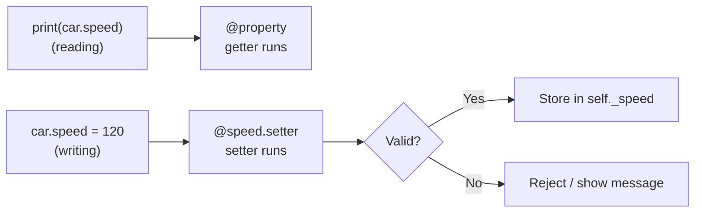

<p align="center">
  
</p>

<p align="center">
  
  
  
  
</p>

# 🟢 Day 05 — Getters and Setters in Python

## 🎯 Learning Objectives

Today I will learn:

- What are getters and setters?
- Why do we use getters and setters?
- What is an instance attribute?
- How to access and update object attributes
- What is the `@property` decorator?
- How does the `@property` getter work?
- How does the `@attribute.setter` work?
- How to validate data before updating an attribute
- How to use getters and setters in real-world classes
- Difference between normal methods and properties

---

# 📖 Day 05 Concepts — Read & Understand First

> Today builds on **Day 04 (Decorators)**: `@property` is a decorator. Read this section slowly, then type every example yourself in VS Code and run it.

## 1️⃣ The Problem: Attributes Have No Protection

On the earlier days, we changed attributes directly. Python allowed **any** value, even nonsense:

```python
class Student:
    def __init__(self, name, age):
        self.name = name
        self.age = age

s = Student("Rahul", 20)
s.age = -5          # ❌ Nobody stopped us
print(s.age)        # -5   (an age can't be negative!)
```

> 😕 In real programs, wrong data causes bugs: a negative price, a bank balance below zero, a battery of 500%.
> We need a way to **control and check** data **before** it is stored. That is what getters and setters do.

---

## 2️⃣ What are Getters and Setters?

| Term       | Meaning                                              | Purpose                               |
| ---------- | ---------------------------------------------------- | ------------------------------------- |
| **Getter** | A method that **returns (reads)** an attribute value | Controlled **reading** of data        |
| **Setter** | A method that **updates (writes)** an attribute value | Controlled **writing** + **validation** |

> 🏧 **Analogy:** An ATM. You can't open the bank's vault (the data) directly. You use the ATM (getter/setter), which checks your PIN and balance before giving anything.

**Why do we need them?**

* ✅ **Validation** — reject wrong values (negative age, empty name…)
* ✅ **Protection** — outside code can't break the object's data
* ✅ **Flexibility** — you can change how data is stored later without changing the code that uses it
* ✅ **Control** — decide what can be read, what can be changed, and what is read-only

This idea of protecting data inside a class is called **encapsulation** (one of the 4 pillars of OOP).

---

## 3️⃣ The Underscore Convention: `_name`

By convention, an attribute starting with **one underscore** means: *"this is internal — don't touch it directly from outside."*

```python
self._speed = 50      # internal attribute (the real stored value)
```

* It is a **convention**, not a lock. Python still lets you access `obj._speed`, but programmers agree not to.
* We store the real value in `_speed`, and give outside code a **getter/setter** to use instead.
* (Formal public / protected / private rules come on **Day 07 — Access Specifiers**.)

---

## 4️⃣ The Traditional Way: `get_` and `set_` Methods

```python
class Car:
    def __init__(self, brand, speed):
        self.brand = brand
        self._speed = speed

    def get_speed(self):                       # getter
        return self._speed

    def set_speed(self, value):                # setter
        if 0 <= value <= 200:
            self._speed = value
        else:
            print("Speed must be between 0 and 200")

car = Car("Tata", 60)
car.set_speed(120)
print(car.get_speed())     # 120

car.set_speed(500)         # Speed must be between 0 and 200
print(car.get_speed())     # 120  (unchanged)
```

This works, but we must write `car.set_speed(120)` and `car.get_speed()` instead of the natural `car.speed = 120`. Python has a nicer way. 👇

---

## 5️⃣ The Pythonic Way: `@property` and `@name.setter`

```python
class Car:
    def __init__(self, brand, speed):
        self.brand = brand
        self._speed = 0              # safe starting value
        self.speed = speed           # goes through the setter (validation runs!)

    @property                        # GETTER
    def speed(self):
        return self._speed

    @speed.setter                    # SETTER
    def speed(self, value):
        if 0 <= value <= 200:
            self._speed = value
        else:
            print("Speed must be between 0 and 200")

car = Car("Tata", 60)
print(car.speed)       # 60     ← getter runs (no brackets!)

car.speed = 120        #        ← setter runs
print(car.speed)       # 120

car.speed = 500        # Speed must be between 0 and 200
print(car.speed)       # 120    (unchanged)

car2 = Car("Maruti", 999)
print(car2.speed)      # prints the warning first, then 0 (the safe starting value)
```



### 🔑 Rules of the pattern

1. The **getter** comes **first**, with `@property`.
2. The **setter** comes **second**, with `@<property_name>.setter` (the name must match the getter's name).
3. Both methods have the **same name** (`speed`).
4. The real value lives in a **separate internal attribute** (`_speed`).
5. Outside code uses `car.speed` — **no brackets, no `get_`/`set_`**.

> 💡 To the user of the class, `car.speed` looks like a normal attribute — but Python secretly runs your getter/setter code.

---

## 6️⃣ Why Do We Use `_speed` Inside the Property?

If the setter wrote to `self.speed`, it would call **itself again**, forever:

```python
@speed.setter
def speed(self, value):
    self.speed = value        # ❌ calls the setter again → infinite loop
```

**Result:**

```text
RecursionError: maximum recursion depth exceeded
```

> ✅ **Rule:** the property is named `speed`; the stored value is named `_speed`. Getter returns `self._speed`; setter assigns `self._speed = value`.

---

## 7️⃣ Use the Setter Inside `__init__` Too

Look at this line in the constructor:

```python
self.speed = speed          # ✅ goes through the setter → validated
```

versus:

```python
self._speed = speed         # ⚠️ skips the setter → no validation
```

> ✅ Write `self.speed = speed` in `__init__` so wrong values are also checked **when the object is created**.
> ⚠️ If the setter only *prints* a message and rejects the value, `_speed` is never set, so the constructor must first give it a safe starting value (like `self._speed = 0`), as in the example above. Otherwise reading it later gives an `AttributeError`.

---

## 8️⃣ Common Validation Checks

Inside a setter you decide what is valid. Typical checks:

| What to check               | Example condition                          |
| --------------------------- | ------------------------------------------ |
| Must be positive            | `value > 0`                                |
| Cannot be negative          | `value >= 0`                               |
| Must be in a range          | `0 <= value <= 100`                        |
| Must not be empty           | `value.strip() != ""`                      |
| Minimum length              | `len(value) >= 6`                          |
| Must contain a character    | `"-" in value`                             |
| Must be one of some options | `value in ["small", "medium", "large"]`    |
| Must be above a limit       | `value >= -273.15`                         |

> 💡 `value.strip()` removes spaces from both ends, so a name made of only spaces is treated as empty.

**Structure to remember:**

```python
@name.setter
def name(self, value):
    if <value is valid>:
        self._name = value          # store only when valid
    else:
        print("Invalid value")      # otherwise reject
```

---

## 9️⃣ Better Practice (Optional): `raise ValueError`

Printing a message is fine for practice. In real projects, a setter usually **raises an error** so the wrong value cannot be ignored:

```python
class Movie:
    def __init__(self, title, rating):
        self.title = title
        self.rating = rating                   # setter validates

    @property
    def rating(self):
        return self._rating

    @rating.setter
    def rating(self, value):
        if not 0 <= value <= 10:
            raise ValueError("Rating must be between 0 and 10")
        self._rating = value

m = Movie("Film A", 8)
print(m.rating)                 # 8

try:
    m.rating = 15
except ValueError as e:
    print("Error:", e)          # Error: Rating must be between 0 and 10
```

Creating `Movie("Film B", 11)` also fails immediately, so a **bad object never gets created**.

> 📌 `try / except` is only a preview here. **Use the `print` message style for today's problems** unless a question says otherwise.

---

## 🔟 Read-Only Properties (Getter Only)

If you create **only the getter** (no setter), the property becomes **read-only**. This is perfect for **calculated values**:

```python
class Rectangle:
    def __init__(self, length, width):
        self.length = length
        self.width = width

    @property
    def perimeter(self):                 # no setter → read-only
        return 2 * (self.length + self.width)

r = Rectangle(4, 3)
print(r.perimeter)       # 14

r.length = 10
print(r.perimeter)       # 26   ← always up-to-date, calculated when you read it

r.perimeter = 5          # ❌ AttributeError: property 'perimeter' of 'Rectangle' object has no setter
```

* No separate `_perimeter` is needed, because the value is **calculated each time** from the other attributes.
* The exact wording of the `AttributeError` depends on your Python version, but it is always an `AttributeError`.

---

## 1️⃣1️⃣ Hiding Sensitive Data

A getter can **decide what to show**. For example, show a masked value instead of the real one:

```python
class Vault:
    def __init__(self, code):
        self._secret_code = code

    @property
    def secret_code(self):
        return "*" * len(self._secret_code)      # mask it

v = Vault("abc12345")
print(v.secret_code)     # ********
```

---

## 1️⃣2️⃣ Property vs Normal Method vs Public Attribute

| Point                    | Public attribute `obj.age`  | Property `obj.age`              | Normal method `obj.get_age()` |
| ------------------------ | --------------------------- | ------------------------------- | ----------------------------- |
| Brackets needed?         | No                          | **No**                          | Yes `()`                      |
| Validation on change?    | ❌ No                        | ✅ Yes (setter)                  | ✅ Yes (if you write it)       |
| Can be read-only?        | ❌ No                        | ✅ Yes (getter only)             | ✅ Yes                         |
| Can be calculated?       | ❌ No                        | ✅ Yes                           | ✅ Yes                         |
| Looks like               | A plain variable            | A plain variable                | A function call               |
| Best for                 | Simple data without rules   | Data with rules / calculated values | Actions (`deposit()`, `withdraw()`) |

> ✅ **Rule of thumb:** use a **property** when it is **data** (age, price, area). Use a **method** when it is an **action** (deposit, calculate, send).

---

## 1️⃣3️⃣ Real-World Uses

| Class           | Property            | Rule                              |
| --------------- | ------------------- | --------------------------------- |
| `BankAccount`   | `balance`           | Cannot be negative                |
| `Person`        | `age`               | Between 0 and 120                 |
| `User`          | `password`          | Minimum length, never shown plainly |
| `Product`       | `price`             | Must be positive                  |
| `Order`         | `total_price`       | Read-only, calculated             |
| `Mobile`        | `battery`           | Between 0 and 100                 |

---

## 1️⃣4️⃣ Common Mistakes (Avoid These!)

| ❌ Mistake                                                        | ✅ Fix                                                              |
| ---------------------------------------------------------------- | ------------------------------------------------------------------ |
| Setter writes to `self.speed` instead of `self._speed`            | Store in `self._speed` (avoids `RecursionError`)                   |
| Calling a property with brackets: `car.speed()`                   | `car.speed` — **no brackets** (`TypeError: 'int' object is not callable`) |
| Setter decorator name doesn't match: `@speed.setter` on `def set_speed` | Method name **must match** the property name: `def speed(self, value)` |
| Writing the setter **before** the getter                          | Getter (`@property`) first, then `@name.setter`                    |
| Validating the value but never storing it                         | Add `self._name = value` inside the valid branch                   |
| Using `self._name = name` in `__init__`                           | Use `self.name = name` so validation also runs at creation          |
| Reading an attribute that was never set (rejected in `__init__`)  | Give a safe starting value first, e.g. `self._speed = 0`           |
| Trying to assign to a read-only property                          | Add a setter, or only read it                                      |
| Printing sensitive data directly                                  | Mask it inside the getter                                          |
| Forgetting `@property` on the getter                              | Add `@property` above the getter method                            |

**🧪 Always test:** a valid value, an invalid value, and boundary values (exactly `0`, exactly `100`, an empty string).

---

## 📌 Day 05 in One Look

```text
Getter       →  Method that READS a value        →  @property
Setter       →  Method that UPDATES + VALIDATES  →  @name.setter
_name        →  Internal attribute that stores the real value
Read-only    →  Property with a getter and NO setter
Calculated   →  Property that returns a value computed from other attributes
In __init__  →  Use self.name = name so the setter runs at creation
Encapsulation→  Protecting data inside the class
```

**Template to remember:**

```python
class ClassName:
    def __init__(self, name):
        self._name = ""              # safe starting value
        self.name = name             # uses the setter

    @property
    def name(self):
        return self._name

    @name.setter
    def name(self, value):
        if <value is valid>:
            self._name = value
        else:
            print("Invalid value")
```

---

## 📚 Theory Checklist

Before solving the problems, I should be able to answer:

1. What is a getter?
2. What is a setter?
3. Why do we need getters and setters?
4. What is data validation?
5. What does `@property` do?
6. What is the purpose of `@name.setter`?
7. How can a setter reject invalid values?
8. What happens if we assign an invalid value to an attribute?
9. What is the difference between a public attribute and a property?
10. Why should a property use a separate internal attribute such as `_name`?
11. Can a property return a calculated value?
12. How are getters and setters useful in real-world applications?

---

## 🧩 Day 05 Practice — 15 Problems

### 🟢 Level 1 — Basic Getter and Setter

#### Q1. Student Name

Create a `Student` class with an attribute `_name`.

- Create a getter to return the student's name.
- Create a setter to update the name.
- Create an object and test both operations.

Use `@property` and `@name.setter`.

#### Q2. Employee Salary

Create an `Employee` class with `_salary`.

- Getter: return the salary.
- Setter: update the salary.
- Reject negative salary values.

Test with valid and invalid values.

#### Q3. Product Price

Create a `Product` class with `_price`.

- Create a getter for the price.
- Create a setter that accepts only prices greater than zero.
- Test different prices.

#### Q4. Person Age

Create a `Person` class with `_age`.

Rules:

- Age cannot be negative.
- Age cannot be greater than 120.
- Valid age should be stored.

Create an object and test the setter with valid and invalid values.

#### Q5. Bank Account Balance

Create a `BankAccount` class with `_balance`.

- Getter: return the current balance.
- Setter: accept a new balance only if it is non-negative.
- Test the property with different values.

---

### 🟡 Level 2 — Validation and Logic Building

#### Q6. Mobile Battery

Create a `Mobile` class with `_battery`.

Rules:

- Battery percentage must be between 0 and 100.
- Invalid values should be rejected.
- Use a property to read and update the battery percentage.

#### Q7. Student Marks

Create a `Student` class with `_marks`.

Rules:

- Marks must be between 0 and 100.
- Reject marks outside this range.
- Display the marks using a getter.

Test at least three different values.

#### Q8. Email Validation

Create a `User` class with `_email`.

- Create a getter and setter.
- Reject an email that does not contain `@`.
- Test with valid and invalid email values.

*Note: This is a beginner-level validation exercise, not complete email validation.*

#### Q9. Password Length

Create a `User` class with `_password`.

Rules:

- Password must contain at least 8 characters.
- Reject shorter passwords.
- Do not print the password directly when displaying user information.

Test different password lengths.

#### Q10. Circle Radius

Create a `Circle` class with `_radius`.

Rules:

- Radius must be greater than zero.
- Use a getter and setter for the radius.
- Create an `area` property that calculates the circle's area.

Formula:

`Area = π × radius²`

---

### 🔴 Level 3 — Real-World OOP Practice

#### Q11. Employee Management

Create an `Employee` class with:

- `_name`
- `_salary`
- `_department`

Requirements:

- Create properties for all three attributes.
- Name and department cannot be empty.
- Salary cannot be negative.
- Create three employee objects and test the properties.

#### Q12. Shopping Product

Create a `Product` class with:

- `_name`
- `_price`
- `_quantity`

Requirements:

- Price must be greater than zero.
- Quantity cannot be negative.
- Create a read-only property `total_price`.

Formula:

`Total Price = price × quantity`

Try to read and calculate the total price for three products.

#### Q13. Temperature Converter

Create a `Temperature` class with `_celsius`.

Requirements:

- Use a getter and setter for Celsius.
- Reject temperatures below absolute zero: `-273.15°C`.
- Create a read-only Fahrenheit property.

Formula:

`Fahrenheit = (Celsius × 9/5) + 32`

Test multiple temperature values.

#### Q14. Student Result System

Create a `Student` class with:

- `_name`
- `_maths`
- `_physics`
- `_chemistry`

Requirements:

- Subject marks must be between 0 and 100.
- Use properties to access and update the marks.
- Create a read-only `total_marks` property.
- Create a read-only `percentage` property.

Create three student objects and display their results.

#### Q15. Bank Account Validation

Create a `BankAccount` class with:

- `_account_holder`
- `_balance`

Requirements:

- Account holder name cannot be empty.
- Balance cannot be negative.
- Use a property to read the balance.
- Create a `deposit(amount)` method that accepts only positive amounts.
- Create a `withdraw(amount)` method that rejects invalid amounts or insufficient funds.

Test valid and invalid operations.

---

## ⭐ Day 05 Challenge — Secure Employee Record

Create an `Employee` class with:

- `_name`
- `_employee_id`
- `_salary`
- `_performance_score`

Requirements:

1. Use properties for the attributes.
2. Name cannot be empty.
3. Employee ID cannot be empty.
4. Salary cannot be negative.
5. Performance score must be between 0 and 100.
6. Create a read-only property named `annual_salary`.
7. Create a read-only property named `bonus`.
8. Apply these bonus rules:

| Performance Score | Bonus Rate |
| ----------------- | ---------: |
| 90–100            |        20% |
| 75–89             |        15% |
| 60–74             |        10% |
| Below 60          |         0% |

Calculate the bonus using the annual salary.

Create at least three employee objects and display their details, annual salary, and bonus.

---

## 🧠 Concept Challenge

Answer these questions in your own words:

1. Why do we use getters and setters?
2. What does `@property` do?
3. Why do we use `_name` instead of directly using `name` inside a property?
4. What is the difference between a getter and a setter?
5. What is a read-only property?
6. How can setters protect data from invalid values?

Write your answers in this README.

---

## 📁 Day 05 Folder Structure

```text
Day05_Getters_Setters/
│
├── banner.svg
├── README.md
├── Q01.py
├── Q02.py
├── ...
├── Q15.py
└── Q16_Challenge.py
```

Write each solution in its own file. Add a comment at the top such as `# Q1`, `# Q2`, and so on.

> Use two-digit file names (`Q01`, `Q02`, … `Q15`) so GitHub shows them in the correct order.

---

## 📊 Day 05 Target

| Task                    |           Target |
| ----------------------- | ---------------: |
| Theory questions        |               12 |
| Basic problems          |                5 |
| Logic-building problems |                5 |
| Real-world problems     |                5 |
| Main challenge          |                1 |
| Total practice problems | 15 + 1 challenge |

---

## 🚫 Rules

- Do not copy solutions.
- Try every question independently first.
- Understand `@property` before using setters.
- Use a separate internal attribute such as `_salary` to avoid recursive property calls.
- Validate values before updating attributes.
- Test both valid and invalid inputs.
- Do not move to Day 6 until you can write a basic getter and setter independently.

---

## ✅ Completion Checklist

- [ ] Understood getters and setters
- [ ] Understood `@property`
- [ ] Understood `@name.setter`
- [ ] Practiced data validation
- [ ] Practiced read-only properties
- [ ] Solved Q1–Q5
- [ ] Solved Q6–Q10
- [ ] Solved Q11–Q15
- [ ] Completed the Employee Record Challenge
- [ ] Tested all programs
- [ ] Updated README
- [ ] Pushed code to GitHub

---

## 🚀 GitHub Commit

```bash
git add .
git status
git commit -m "Day 05: Getters and setters practice"
git push
```

**Day 05 Goal:** Learn to access, update, and validate object attributes using Python properties.

---

<p align="center">
  
</p>

<h3 align="center"><b>Sudhanshu Dhande</b></h3>
<p align="center"><i>B.Tech (AI &amp; ML) · BATU, Lonere · Python OOP Journey</i></p>