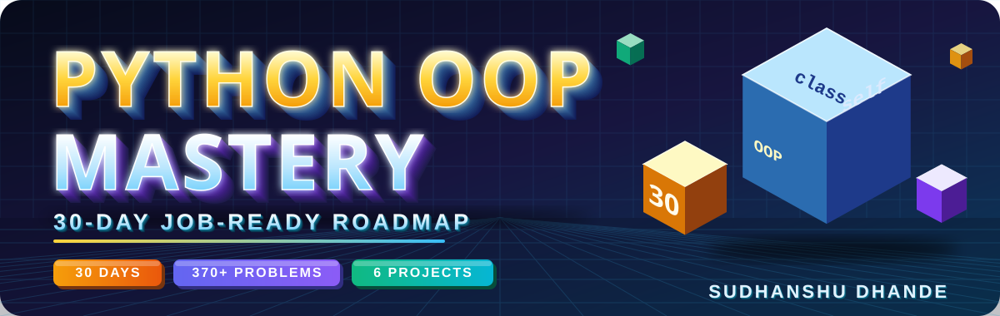
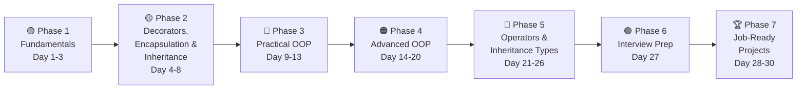

<p align="center">
  
</p>

<p align="center">
  
  
  
  
  
  
</p>

<p align="center">
  <b>Learn → Practice → Build → Push → Revise</b>
</p>

This repository contains my **30-Day Python OOP Practice Journey**.

The goal is not only to complete the videos, but to build strong **Object-Oriented Programming skills through daily coding practice, problem solving, projects, and GitHub contributions.**

---

## 🎯 Goals

By completing this roadmap, I aim to:

* Understand Python OOP concepts from basics to advanced
* Solve **10–15 coding problems every day**
* Build real-world OOP projects
* Improve problem-solving and logical thinking
* Prepare for Python/OOP technical interviews
* Write clean and structured Python code
* Maintain a consistent GitHub coding history
* Become more confident in using OOP in AI/ML projects

---

## 📚 Learning Source

| | |
| --- | --- |
| **Course** | CodeWithHarry — Python for Beginners (Full Course) \| #100DaysOfCode Programming Tutorial in Hindi |
| **Playlist** | [Watch on YouTube](https://youtube.com/playlist?list=PLu0W_9lII9agwh1XjRt242xIpHhPT2llg) |
| **OOP starts at** | Around Day 57 of the course |

---

## 🧭 Roadmap at a Glance



| Phase | Days | Focus | Outcome |
| :-- | :-: | :-- | :-- |
| 🟢 Fundamentals | 01–03 | Classes, objects, constructors, `self` | Can create and use classes |
| 🟡 Decorators, Encapsulation & Inheritance | 04–08 | Decorators, getters/setters, inheritance, access specifiers | Can protect data and reuse code |
| 🔵 Practical OOP | 09–13 | Static methods, variables, mini projects | First real projects |
| 🟠 Advanced OOP | 14–20 | Class methods, `super()`, dunder methods, overriding | Writes Pythonic classes |
| 🔴 Operators & Inheritance Types | 21–26 | Operator overloading, all inheritance types, PDF project | Understands class hierarchies |
| 🟣 Interview Prep | 27 | Polymorphism, abstraction, 30+ interview questions | Interview ready |
| 🏆 Job-Ready Projects | 28–30 | Banking, E-Commerce, Student Management | Portfolio projects |

---

## 🗺️ 30-Day OOP Roadmap

## 🟢 Phase 1 — OOP Fundamentals

### Day 01 — Classes & Objects

**Topics**

* Class
* Object
* Attributes
* Methods
* `self`
* Creating multiple objects

**Practice:** 15 problems

### Day 02 — Constructors

**Topics**

* `__init__`
* Constructor
* Constructor arguments
* Instance variables
* Default values

**Practice:** 15 problems

### Day 03 — `self` & Constructor Practice

**Focus**

* Understanding `self`
* Instance data
* Multiple objects
* Constructor-based programs

**Practice:** 15 problems

---

## 🟡 Phase 2 — Decorators, Encapsulation & Inheritance

### Day 04 — Decorators

**Topics**

* Functions as objects
* Nested functions
* Decorators
* Wrapper functions
* `@decorator`

**Practice:** 10–12 problems

### Day 05 — Getters & Setters

**Topics**

* Getter
* Setter
* Property
* Encapsulation
* Controlled access to data

**Practice:** 15 problems

### Day 06 — Inheritance

**Topics**

* Parent class
* Child class
* Code reusability
* Inherited methods

**Practice:** 15 problems

### Day 07 — Access Specifiers

**Topics**

* Public
* Protected
* Private
* Name mangling

**Practice:** 12–15 problems

### Day 08 — OOP Revision

**Topics**

* Classes
* Objects
* Constructors
* Getters
* Setters
* Inheritance
* Access specifiers

**Practice:** 20 mixed problems

---

## 🔵 Phase 3 — Practical OOP

### Day 09 — Library Management System

**Build a mini project using OOP.**

**Classes**

* `Book`
* `Library`
* `Student`

**Features**

* Add book
* Remove book
* Search book
* Issue book
* Return book
* Display books

### Day 10 — Static Methods

**Topics**

* `@staticmethod`
* Static methods
* Instance method vs static method

**Practice:** 12 problems

### Day 11 — Class Variables & Instance Variables

**Topics**

* Instance variables
* Class variables
* Shared data
* Object-specific data
* Overriding class attributes

**Practice:** 15 problems

### Day 12 — OOP Revision

**Practice:** 20 mixed problems

**Focus**

* Class vs object
* Instance vs class variables
* Static methods
* Inheritance
* Encapsulation

### Day 13 — Practical Python Project

Build a **File Organizer**.

**Features**

* Detect file types
* Create folders
* Move files
* Organize files automatically

Focus on using classes to structure the program.

---

## 🟠 Phase 4 — Advanced OOP

### Day 14 — Class Methods

**Topics**

* `@classmethod`
* `cls`
* Class-level operations

**Practice:** 12 problems

### Day 15 — Alternative Constructors

**Topics**

* Alternative constructors
* `@classmethod`
* Creating objects from different data formats

**Practice:** 10–12 problems

Examples:

* `Student.from_string()`
* `Product.from_dict()`
* `Employee.from_csv()`

### Day 16 — Object Inspection

**Topics**

* `dir()`
* `__dict__`
* `help()`
* Object attributes
* Class attributes

**Practice:** 10 problems

### Day 17 — `super()`

**Topics**

* Parent constructor
* Parent methods
* `super()`
* Parent-child relationships

**Practice:** 15 problems

### Day 18 — Dunder / Magic Methods

**Topics**

* `__init__`
* `__str__`
* `__repr__`
* `__len__`
* `__add__`
* `__eq__`

**Practice:** 15 problems

### Day 19 — Method Overriding

**Topics**

* Parent methods
* Child methods
* Method overriding
* Runtime behavior

**Practice:** 15 problems

### Day 20 — Complete OOP Revision

**Practice:** 25 mixed problems

**Concepts covered**

* Classes
* Objects
* Constructors
* Getters
* Setters
* Inheritance
* `super()`
* Class variables
* Instance variables
* Static methods
* Class methods
* Method overriding
* Dunder methods

---

## 🔴 Phase 5 — Operators & Inheritance Types

### Day 21 — PDF Management Project

Build a small **PDF Management System** using Python and OOP.

**Focus**

* Classes
* Methods
* External libraries
* File handling
* Project structure

### Day 22 — Operator Overloading

**Topics**

* `__add__`
* `__sub__`
* `__mul__`
* `__eq__`
* `__lt__`
* `__gt__`

**Practice:** 15 problems

Examples:

* Money + Money
* Point + Point
* Distance + Distance
* Time + Time
* Student comparison

### Day 23 — Single Inheritance

**Practice:** 15 problems

Examples:

```text
Animal → Dog
Vehicle → Car
Person → Student
Employee → Manager
```

### Day 24 — Multiple Inheritance

**Topics**

* Multiple parent classes
* Multiple inheritance
* Method resolution

**Practice:** 10–12 problems

### Day 25 — Multilevel Inheritance

Example:

```text
Animal
   ↓
Mammal
   ↓
Dog
```

**Practice:** 12 problems

### Day 26 — Hierarchical & Hybrid Inheritance

**Topics**

* Hierarchical inheritance
* Hybrid inheritance
* Multiple inheritance combinations
* MRO basics

**Practice:** 10–15 problems

---

## 🟣 Phase 6 — Interview Preparation

### Day 27 — Polymorphism, Abstraction & OOP Interview Preparation

**Part A — Concepts not covered earlier (learn first)**

These topics are common in interviews but are not part of the earlier days, so I will learn them first.

* Polymorphism
* Abstraction (`ABC`, `@abstractmethod`)
* Composition (has-a relationship)
* Aggregation

**Practice:** 10 problems

**Part B — Interview questions**

Prepare at least **30 conceptual + coding questions**.

**Topics**

* What is OOP?
* Class vs Object
* `self`
* Constructor
* Instance variable
* Class variable
* Static method
* Class method
* Getter & Setter
* Encapsulation
* Inheritance
* Polymorphism
* Abstraction
* Method overriding
* Operator overloading
* `super()`
* MRO
* Dunder methods
* Public / Protected / Private
* Decorators
* Composition
* Aggregation

---

## 🚀 Phase 7 — Job-Ready Projects

### Day 28 — Banking Management System

**Classes**

```text
Bank
Account
SavingsAccount
CurrentAccount
Customer
```

**Features**

* Create account
* Deposit money
* Withdraw money
* Check balance
* Transfer money
* Display account details

### Day 29 — E-Commerce Management System

**Classes**

```text
Product
Customer
Cart
Order
Payment
```

**Features**

* Add product
* Remove product
* Add to cart
* Remove from cart
* Calculate total
* Apply discount
* Place order
* Payment processing

### 🏆 Day 30 — Student Management System

**Classes**

```text
Person
Student
Teacher
Course
Result
College
```

**Features**

* Add student
* Add teacher
* Add course
* Add marks
* Calculate percentage
* Calculate grade
* Search student
* Display result

This project should combine almost all the OOP concepts learned during the roadmap.

---

## 📊 Daily Practice Target

| Day Type            |           Problems |
| ------------------- | -----------------: |
| Normal Learning Day |              10–15 |
| Revision Day        |              20–25 |
| Interview Day       |                30+ |
| Project Day         | 1 complete project |

**Target:** approximately **370–385 coding problems and 6 projects in 30 days.**

---

## 🧠 Problem-Solving Rules

I will follow these rules throughout the journey:

### Rule 1 — Don't Copy Code

I will first understand the concept and then write the code myself.

### Rule 2 — Try Before Seeing the Solution

For every problem:

```text
Understand
    ↓
Think about logic
    ↓
Write code
    ↓
Run code
    ↓
Debug
    ↓
Improve
```

### Rule 3 — If Stuck

I will:

1. Read the question again
2. Write the logic in simple words
3. Try the code myself
4. Identify the error
5. Take a hint if required
6. Look at the solution only as a last option
7. Close the solution and rewrite it myself

---

## 📁 Repository Structure

```text
python-oop-practice/
│
├── README.md
├── banner.svg
│
├── Day01_Classes_Objects/
├── Day02_Constructors/
├── Day03_Self_Practice/
├── Day04_Decorators/
├── Day05_Getters_Setters/
├── Day06_Inheritance/
├── Day07_Access_Specifiers/
├── Day08_OOP_Revision/
├── Day09_Library_Management/
├── Day10_Static_Methods/
├── Day11_Class_Instance_Variables/
├── Day12_OOP_Revision/
├── Day13_File_Organizer/
├── Day14_Class_Methods/
├── Day15_Alternative_Constructors/
├── Day16_Object_Inspection/
├── Day17_Super/
├── Day18_Dunder_Methods/
├── Day19_Method_Overriding/
├── Day20_OOP_Revision/
├── Day21_PDF_Project/
├── Day22_Operator_Overloading/
├── Day23_Single_Inheritance/
├── Day24_Multiple_Inheritance/
├── Day25_Multilevel_Inheritance/
├── Day26_Hierarchical_Hybrid/
├── Day27_Polymorphism_Abstraction_Interview/
├── Day28_Banking_System/
├── Day29_Ecommerce_System/
└── Day30_Student_Management_System/
```

---

## 📝 Daily Folder Format

Practice days:

```text
Day01_Classes_Objects/
│
├── banner.svg
├── README.md
├── Q01.py
├── Q02.py
├── ...
├── Q15.py
└── Q16_Challenge.py
```

> Question files use two digits (`Q01`, `Q02`, … `Q15`) so GitHub shows them in the correct order.

Project days:

```text
Day28_Banking_System/
│
├── main.py
├── models.py
├── README.md
└── requirements.txt
```

---

## 🔥 GitHub Workflow

Every day I will push my work to GitHub.

```bash
git add .
git status
git commit -m "Day 01: Classes and Objects practice"
git push
```

**Commit message format**

```text
Day 01: Classes and Objects practice
Day 02: Constructors practice
Day 03: Self and Object practice
...
Day 30: Student Management System
```

---

## 📈 Progress Tracker

| Day | Topic                                   | Practice | Project | Status |
| --: | --------------------------------------- | -------: | :-----: | :----: |
|  01 | Classes & Objects                       |       15 |    ❌    |    ✅   |
|  02 | Constructors                            |       15 |    ❌    |    ✅   |
|  03 | Self Practice                           |       15 |    ❌    |    ⬜   |
|  04 | Decorators                              |    10–12 |    ❌    |    ⬜   |
|  05 | Getters & Setters                       |       15 |    ❌    |    ⬜   |
|  06 | Inheritance                             |       15 |    ❌    |    ⬜   |
|  07 | Access Specifiers                       |    12–15 |    ❌    |    ⬜   |
|  08 | Revision                                |       20 |    ❌    |    ⬜   |
|  09 | Library Management                      |        — |    ✅    |    ⬜   |
|  10 | Static Methods                          |       12 |    ❌    |    ⬜   |
|  11 | Class & Instance Variables              |       15 |    ❌    |    ⬜   |
|  12 | Revision                                |       20 |    ❌    |    ⬜   |
|  13 | File Organizer                          |        — |    ✅    |    ⬜   |
|  14 | Class Methods                           |       12 |    ❌    |    ⬜   |
|  15 | Alternative Constructors                |    10–12 |    ❌    |    ⬜   |
|  16 | Object Inspection                       |       10 |    ❌    |    ⬜   |
|  17 | `super()`                               |       15 |    ❌    |    ⬜   |
|  18 | Dunder Methods                          |       15 |    ❌    |    ⬜   |
|  19 | Method Overriding                       |       15 |    ❌    |    ⬜   |
|  20 | Revision                                |       25 |    ❌    |    ⬜   |
|  21 | PDF Project                             |        — |    ✅    |    ⬜   |
|  22 | Operator Overloading                    |       15 |    ❌    |    ⬜   |
|  23 | Single Inheritance                      |       15 |    ❌    |    ⬜   |
|  24 | Multiple Inheritance                    |    10–12 |    ❌    |    ⬜   |
|  25 | Multilevel Inheritance                  |       12 |    ❌    |    ⬜   |
|  26 | Hierarchical & Hybrid                   |    10–15 |    ❌    |    ⬜   |
|  27 | Polymorphism, Abstraction & Interview   |  10 + 30+ |    ❌    |    ⬜   |
|  28 | Banking System                          |        — |    ✅    |    ⬜   |
|  29 | E-Commerce System                       |        — |    ✅    |    ⬜   |
|  30 | Student Management System               |        — |    ✅    |    ⬜   |

> ✅ Done · ⬜ Pending

---

## 🎯 Final Goal

After completing this roadmap, I should be able to:

* Design classes independently
* Understand and use OOP concepts confidently
* Solve OOP-based coding problems
* Build real-world Python applications
* Explain OOP concepts in interviews
* Read and understand existing Python OOP code
* Write cleaner and reusable Python code
* Use OOP concepts in future AI/ML projects

---

## 🚀 My OOP Journey

| | |
| --- | --- |
| **Start** | Day 01 |
| **Duration** | 30 Days |
| **Daily Practice** | 10–15 Problems |
| **Major Projects** | 6 |
| **Target** | Python OOP + Problem Solving + Interview Readiness |

> **Consistency > Speed**
>
> **Don't just watch the code. Write the code.**
>
> **Learn → Practice → Build → Push → Repeat.**

---

<h3 align="center"><b>Sudhanshu Dhande</b> </h3>
<p align="center"><i>B.Tech(AI &amp; ML) · BATU, Lonere · Python OOP Journey</i></p>